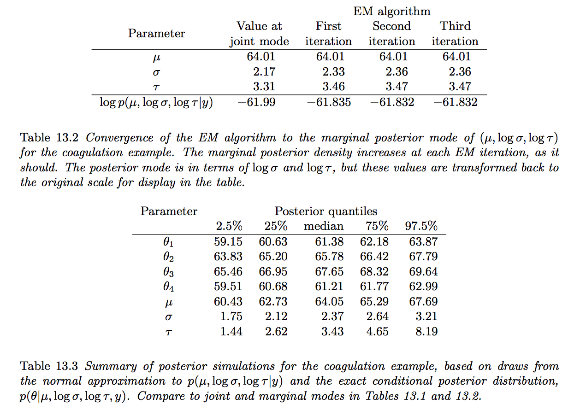

```{r knitr_init, echo=FALSE, cache=FALSE}
library(knitr)

## Global options
options(max.print="75")
opts_chunk$set(echo=FALSE,
	             cache=TRUE,
               prompt=FALSE,
               tidy=TRUE,
               comment=NA,
               message=FALSE,
               warning=FALSE)
opts_knit$set(width=75)
```

最初に、低次元の問題でのシミュレーション手法について説明する。 複雑なモデルでは、事後分布からのサンプルを直接得ることはできない。第11章と第12章では、このようなモデルで使用できる反復シミュレーションアルゴリズムについて説明した。 この章では、分布近似に基づくさまざまなアプローチについて説明する。 これらの方法は、迅速な推論、マルコフ連鎖シミュレーションアルゴリズムの開始点、反復シミュレーションアプローチが遅すぎる大きな問題に役立つ。   記述する近似は比較的計算が簡単なもので、モデルの近似に関する貴重な情報を提供していく。  

13.1節では、事後モード(**posterior mode**)を見つけるためのアルゴリズムについて説明する。分布近似を構築する上で有用であること以外にも、事後モードは統計的実践において，ポイント推定値として使用されることが多く、時には（前の密度の対数がペナルティ関数とみなされる)ペナルティ尤度推定のように見える。 13.2項では、modeによって事後分布を要約することが目標である場合、フルベイジアン推論で使用されるものとは異なる事前分布を使用することができる話をする。   13.3節では、モードを中心とした正規分布と混合正規分布の近似を示す。13.4-13.6章は、EM（**expectation maximization**）と関連する方法を用いて、事後モードを見つけるための方法を紹介する。最後に、13.7節と13.8節では、変分ベイズと期待伝播を紹介する。条件付きモーメントに基づいて分布への近似を構築する2つの方法を紹介する。

# 13.1 モードを見つける

ベイズ計算では，事後密度のマッピングを開始する方法としてモードを探す。
特に、事後密度の最大点を求めること自体に特別な関心はない。 多くのモードが存在する場合、それらをすべて見つけようとするか、少なくともそれらの近隣に無視できない後方質量?(**posterior mass**)を伴うモードを見つけようとするべきである。<font color="blue">(おそらく、モード付近にもある程度の密度がある点という意味で、一点だけ尖ってるようなのは望ましくないのかと思います)</font> 実際には、最初に単体のモードを探索し、それが実質的な意味で妥当でないと思われる場合は、引き続き他のモードのパラメータ空間を探索する。 すべてのローカルモードを見つけたり、見つかったモードが唯一の重要なモードであることを確認するには、異なる開始点から数回モード探索アルゴリズムを実行する必要がある。

可能であれば、パラメータのサブセットの周辺事後密度のモードを見つけることがさらに良い。 その後、残りのパラメータの分布を分析し、条件付きで第1の部分集合を決定する。 セクション13.4と13.5でこのトピックをもう一度扱う。
最適化問題を解くための数値計算法は数多く存在し、いずれも事後密度のモードを見つけるために原理的に適用することができる。 この膨大なトピックを包括的にカバーするのではなく、統計的な問題でよく使われる2つの簡単な方法を紹介する。

## 条件付き最大化

モードを見つける最も簡単な方法は、段階的な上昇とも呼ばれる条件付きの最大化である。単純にパラメータを大まかな見積もりで設定するなど、ターゲット分布のどこかで開始してから、一度に1つの$\theta$の成分を変更し、他の成分を以前の値のままで、各ステップでlogの事後密度を増加させる。事後密度が限定されていると仮定すると、ステップは最終的にはローカルモードに収束する。  
loglinearモデル（項16.7を参照）の反復比例フィッティング?(**iterative proportional fitting**)の方法は、条件付き最大化の例である。複数のモードを探索するには、パラメータ空間全体に広がったさまざまな点から始まる条件付き最大化ルーチンを実行する。ただし、パラメータの大まかな見積もりと、パラメータの合理的な範囲に関する問題固有の知識に基づいて、合理的な出発点の範囲を見つけることが可能でなければならない。   
多くの標準統計モデルでは、他のすべてのパラメータが与えられた各パラメータの条件付き分布は簡単な解析形式を持ち、容易に最大化される。この場合、条件付き最大化アルゴリズムを適用するのは簡単である。一度に1セットのパラメータに対して密度を最大化し、ステップが収束して近似収束に達するまで繰り返す。普通の(**normalな**)階層的なモデルの例については、13.6節でこのプロセスを説明する。

## ニュートン法  

Newton-Raphsonアルゴリズムとも呼ばれるNewton法は、
対数事後尤度の二次テイラー級数近似で、
$$
L(\theta) = \log p(\theta|y).
$$
ニュートン法は$L（\theta）$の導関数のみを使用し、pの任意の乗法定数はLの加法の定数であるため<font color="blue">(p^2=2Lという意味だと思います)</font>、正規化されていない事後密度を使用することも許容される。 第4章で見てきたように、二次の近似は データポイントの数がパラメータの数に対して大きい場合にはかなり正確である。 まず、関数$L '(\theta)$と$L''(\theta)$を求める。それぞれ、微分のベクトルと二次微分の行列である。
微分係数は、分析的または数値的に決定することができる。 モード探索アルゴリズムは次のように進行する。

- 開始値$\theta^0$を選択する。 
- $t = 1,2,3\dots$
    - $L'(\theta_{t-1})$と$L''(\theta_{t-1})$を計算する。時刻tにおけるニュートン法のステップは、$\theta_{t-1}$を中心とする$L(\theta)$に対する二次近似に基づく。
    - 二次近似を最大にするために新しい反復$\theta_t$を設定する。 したがって

$$\theta^t=\theta^{t-1} - [L''(\theta^{t-1})]^{-1}L'(θ^{t-1})$$

開始値$\theta_0$は重要である。 アルゴリズムは、特に$-L ''$が正定値でない問題では、すべての開始値から収束することが保証されていない。 開始値は粗パラメータ推定値(crude parameter)から得ることができ、条件付き最大化を用いてニュートン法の開始値を生成することができる。 ニュートン法の利点は、二次近似が正確であるとき，反復が解に近ければ収束が非常に速いこと。 反復が収束しない場合、多くの場合はパラメータ空間の端に向かって素早く移動するので、次のステップは新たな開始点で再試行する。

## Quasi-Newton and conjugate gradient methods

ニュートン方での$-L''$の計算と保存にはコストがかかるかもしれない。 Broyden-Fletcher-Goldfarb-Shanno（BFGS）法のような準ニュートン法は、勾配情報のみを用いて反復的に$-L''$の近似を形成する。
共役勾配法は勾配情報のみを使用するが、最急降下の代わりに後続の最適化方向は共役方程式を使用して形成される。 共役勾配は、ニュートン法や準ニュートン法よりも反復回数が多くなるが、繰り返し回数が少なくなり、必要な記憶量も少なくなる。

## Numerical computation of derivatives

対数事後密度の第一次微分と第二次微分を理論的に決定することが困難な場合、有限差分を用いて数値的にそれらを近似することができる。$L'$の各成分は，任意の指定値$\theta=(\theta_1、...、\theta_d)$で数値的に推定することができる。

$$
L'_i(\theta) = dL ≈ L(\theta + \delta_i e_i|y) − L(\theta − \delta_i e_i|y),
$$
ここで、$\delta_i$は小さな値であり、線形代数表記を使用して、$e_i$は$\theta$のi番目の成分に対応する単位ベクトルである。 $\delta_i$の値は、問題の規模に基づいて選択される。 通常、0.0001などの値は、微係数を近似するのに十分低く、コンピュータの丸め誤差を回避するのに十分高い値である。 $\theta$における二次微分行列は、差分を再度適用することによって数値的に推定される。 各i、jについて：

$$
L''(\theta)=\frac{d^2L}{d\theta_i d\theta_j} = \frac{d}{d\theta_j}(\frac{dL}{d\theta_i})\\
\approx \frac{L_i'(\theta + \delta_je_j|y) − L′_i(\theta − \delta_je_j|y)}{2\delta_j} \\
\approx[L(\theta+δiei +δjej)−L(\theta−\delta_ie_i +\delta_je_j)\\
 −L(\theta + \delta_ie_i − \delta_je_j) + L(\theta − \delta_ie_i − \delta_je_j)]/(4\delta_i\delta_j).  \hspace{10mm}(13.2)
$$


# 13.2 モデル要約の事前分布による境界?(**boundry**)回避

## パラメータ空間の境界(**boundry**)における事後モード

後方モードは対称事後分布の良い点の要約である。   しかし、事後分布が非対称である場合、モードは不良点推定となり得る。
たとえば、次の図のように8つの学校の例におけるグループレベルの尺度パラメータの事後分布を考えてみる。 


(周辺)事後分布のモードは$\tau= 0$であり、これは、大学入学試験における教育の効果が、8つの学校すべてで同じであるモデルに対応する。 この結論は、データと一致している（ゼロが後方モードであることが示されている）が、実際の根拠によれば、まったくゼロであるとは信じられない(8つの学校の教育プログラムは異なり、 効果も少しは違うはずなので。)

ベイズ全体の観点からは、図13.1に示す事後分布は問題ではない。 $\tau$の事前分布に一様分布を用いる事は、このパラメータが任意に小さい事を可能にするが、しかし、我々は$\tau=0$という事象にはゼロ確率を正確に割り当てる。 得られた事後分布は連続空間上で定義され、無作為シミュレーション、またはポイント要約が必要な場合は事後メディアン（この例では4.9の妥当な値を取る）によって要約することができる。
周辺尤度のモードがゼロになる問題は、8つの学校の例だけで生じる訳ではない。 J = 10のグループを使って、抜粋した例を示す。

$$
y_j \sim N(\theta_j,1), for j = 1,...,J,
$$

簡略化のため、0を中心とする正規分布を有する$\theta_j'$をモデル化する。

$$
\theta_j' \sim N(0,\tau^2).
$$


シミュレーションでは、$\tau=0.5$と仮定する。


このモデルから、1000個のシミュレートされたデータセットyを作成する。 それぞれについて、周辺尤度とそれが最大になる値を決定する。<font color="blue">(こっから後の図の解説がよく分かりません・・・。)</font>


図13.2aは、$\tau$の最大周辺尤度推定値の$\tau=0.5$の分布からのサンプリング分布を示している（この単純な例では、
$\hat{\tau}$は$\hat{\tau}=0 if \frac{1}{J}\sum_{j=1}^J y^2 <1$という境界制約の上で，$1+\hat{\tau}^2=\frac{1}{J}\sum_{j=1}^J y_j^2$で解く。)
 
 
100個のシミュレーション結果から$\tau$の推定分布を示した図13.2bを見ると、ほぼ半分のシミュレーションで、
周辺尤度は$\hat{\tau}=0$で最大になる。
ここでは十分なnoiseが含まれており、グループレベルの差異を超えて何もする事ができない。 このデータからは正確な推定ができない。

## グループレベルの分散パラメータで0を避ける事前分布

この問題は、モードが事後の要約であると扱うために発生する。モードで事後分布を要約する場合、それを踏まえて事前分布を選択する事が理にかなっている。
では、学校の問題のような境界推定を避ける、適切な非常的事前分布とは何か  
先ずは$\tau=0$の確率を0にする。  
正の確率変数に対する便利な確率モデルには、対数正規分布や逆正規分布があり、これは我々が検討しているモデルでも共役である。残念ながら?、これらの分布は0付近で急激に切断される。
対数正規分布や逆ガンマ分布は有効下限を持ち、その下限を下回ると急激に先行密度が低下しゼロ付近の$\tau$を効果的に遮断する。これらのモデルのスケールパラメータが十分に曖昧に設定されている場合は，この下限を極端に低く出来るが、その前に強く尖らせられる。 したがって、これらのモデルでは合理的なデフォルトの設定はない。
ゼロ付近の$\tau$の値を排除するあいまいな事前選択、またはデータのスケールに関して非常に有益な分布を選択する必要がある。

代わりに我々は、$Gamma(2,\frac{2}{A})$などのshape=2のガンマ分布、もしくはより多くのパラメータを持つ分布を好む。


 この密度は、$\tau= 0$のときに0から始まり、そこから直線的に増加し、最終的には$\tau$の大きな値に対して穏やかにゼロに戻る。$\tau=0$での線形な振る舞いは、尤度がどれほど集中していても、事後分布は対数正規分布または逆ガンマ事前分布を保持しない特性であるデータと一致することを保証する。

ここでもまた、この事前分布の目的は、階層モデルを用いた統計的計算でよくあるように、$\tau$の正の分布をそのモードで要約するときに良い見積もりを与えることである。

 事後シミュレーションの使用を計画していたとしても、ガンマ事前分布には何の利点も見られず、第5章で議論されているように、デフォルトの選択肢として均一または半Cauchyを使用する。

## 相関パラメータの境界回避事前分布

次に、2×2群レベルの分散行列を用いて変化する切片、変化する勾配回帰の単純なモデルを用いて、相関パラメータを推定することの困難性を説明する。

各グループ$j = 1,\dots,J$で線形モデルを仮定する：
$$y_{ij} \sim N(\theta_{j1}+\theta_{j2}x_i,1), \hspace{2mm}for\hspace{2mm}i=1,...,n_j.$$

シミュレーションでは$x_i$を単位正規分布から独立に抽出し、全てのjに対して$n_j=5$とする。先ほどはj=10で行った。

jの各グループでの二つの回帰パラメータは正規分布からランダムに取り出す。
$$
\left(
     \begin{array}{r}  
          \theta_{j1} \\
          \theta_{j2} \\
        \end{array}
    \right)\sim
    N\left(\left(
    \begin{array}{r}  
          0 \\
          0 \\
        \end{array}
    \right),
    \left(
    \begin{array}{rr}  
          \tau_1^2 & p\tau_1\tau_2 \\
           p\tau_1\tau_2 & \tau_2^2 \\
        \end{array}
        \right)
    \right)
$$
先ほどの例では、線形パラメータ$\theta$を平均とし、周辺分布を用いて、分析的に計算する事が出来る
$$
p(y|\tau_1,\tau_2,\rho)=N(\hat{\theta_j}|0,V_j+T)
$$
ここで$\hat{\theta_j},V_j$は、最小二乗推定量であり、対応する共分散行列は、グループjのデータについてxをyに回帰することから、
$$T=\left(\begin{array}{rr}\tau_1^2 & p\tau_1\tau_2 \\
           p\tau_1\tau_2 & \tau_2^2 \\
        \end{array}
        \right)$$

この例では、分散パラメータの真の値を$\tau_1=\tau_2=0.5$と$\rho=0$と仮定している。$\rho$の推定値を安定させ、境界から遠ざけるという目標のためには、真の値を0に設定する必要があり、最良の場合のシナリオを選んでいる。 しかし、ここでも、問題がある。

先ほどと同様に、データをシミュレートし、1000回の周辺尤度を計算する。
この例では、$\rho$に焦点を当てているので、$(\tau_1,\tau_2,\rho)$の最大周辺尤度推定値における$\rho$の値を見て、$\rho$のプロファイル尤度も見る。 すなわち関数$L_{profile}(\rho|y)=max_{tau_1,\tau_2}p(y|\tau_1,\tau_2,\rho)$である。


回帰モデルの標準であるように、これらの定義はすべてxに対して暗黙的に条件付きであり、14.1節でさらに論じる点である。
シミュレーションごとに、グリッド内の各$\rho$に個別に適用される数値最適化ルーチンを使用して、プロファイル尤度を$\rho$の関数として計算する。周辺尤度関数は閉じた形で書くことができるので、最適化は容易である。
均一な事前分布$(\tau_1,\tau_2,\rho)$を平均化し$\rho$の周辺事後密度は、解決するためにより多くの努力を要するが、同様の結果をもたらすであろう。
図13.4に結果を示す。

1000回のシミュレーションでは、グループレベル相関の最大周辺尤度推定値は10％にわたって境界$(\rho=\pm1)$にあり、プロファイルの$\rho$の周辺尤度は一般的にあまり有益ではない。
ベイズ全体の設定では、$\rho$を平均化する。 罰則を課された可能性のある枠組みでは、より安定したポイント見積もりが望まれる。
$\rho$の事後モードによる推論を要約する予定であれば、U(−1,1)の事前分布を$p(\rho)\propto(1-\rho)(1+\rho)$で置き換える。これは、変換されたパラメータ$\frac{\rho+ 1}{2}$のBeta（2,2）に相当する。
事前および結果の事後密度は境界でゼロであり、したがって事後モードは-1か1になることはなる。しかし、このセクションの前半で説明した$Gamma(2,\frac{2}{A})$の事前分布と同様に、$\rho$の事前密度は境界付近で線形であり、従って尤度に反することはない。

## 縮退 - 共分散行列の事前分布を避ける

より一般的には、モードベースの点推定または共分散行列の計算近似を非縮退、すなわち正の分散パラメータと正定相関行列とすることが望ましい。
ここでも、共分散行列が縮退しているときにゼロになる事前密度を選択することによって、後方モードでこの特性を保証することができる。
上記の1次元および2次元解と同様に、一般的なd×d共分散行列では、ゼロであるが境界で正の定数導関数を有する$Wishart(d+3,AI)$事前密度を選択する。
これまでのように、問題の状況に基づいてAを大きな値に設定することができる。
結果として得られる共分散行列の推定値は、常に正定値であるが、尤度によってそれらがサポートされている場合、境界付近の推定値を除外することはない。
Aの大きな値の限界では、共分散行列上のWishart(d+3,AI)事前分布は、$\delta\rightarrow 0$での、各固有値上の独立したガンマ(2,$\delta$)事前分布に対応し、したがって、上記の分散パラメータのデフォルトモデルの一般化として見ることができる。
2次元では、$A\rightarrow \infty$の周辺多変量モデルは、先ほどのように事前分布$p(\rho)\propto(1+\rho)(1-\rho)$に対応する。  
また、共分散行列の推論を事後モードで要約したり近似したりするならば、既定のWishart事前分布族を非情報的選択として参照します。
完全なベイジアン推論の場合、境界でゼロになる事前分布を選択する必要はない。
5.7節で論じたHalf・Cauchy事前分布を一般化するスケーリングされた逆Wishartモデルのようなものが好まれるだろう。 

# 13.3 正規分布と関連する混合分布

## モードの曲率に基づいて多変量正規分布を当てはめる

モードが見つかったら（前節で説明した境界回避の事前分布を含んだ後に）、（多変量）正規分布に基づいて近似を作成することができる。
簡単にするために、最初に$\theta$における単一モードの場合を考える。ここで、$\theta$における対数事後密度関数の最初の2つの導関数に正規分布を適合させる。

$$
P_{normal\hspace{2mm}approx}(\theta) = N(\hat{\theta} | V_\theta)
$$
分散行列は、モードにおける対数後部密度の曲率の逆数であり、$V_\theta\left[- \frac{d^2 log p(\theta|y)}{d\theta^2}|_{\theta=\hat{\theta}} \right]^{-1}$であり、この二次導関数は、いくつかの問題について解析的に計算することができ、あるいは（13.2）のように数値で近似することができる。  
いつものように、正規分布を当てはめる前に、対数とその逆関数を使ってパラメータを適切なものに変換することが理にかなっているので、それらはほぼ対称的な分布を持つ実線全体で定義される(事後密度を 1.8節のように変換されたヤコビ行列)。  

## ラプラスの積分の解析近似法

ラプラス法を用いて、平滑関数の積分を事後確率$h(\theta)p(\theta| y)$に近似することができる。近似は$\theta$における（多変量）正規密度に比例し、その積分はちょうど
$$
approximation\hspace{2mm}of\hspace{2mm} E(h(\theta)|y):h(\theta_0|y)(2\pi)^{d/2}|-u''(\theta_0)|^{1/2},
$$
ここでdは$\theta$の次元であり，$u(\theta)=log(h(\theta)p(\theta|y))$で、$\theta_0$は$u(\theta)$が最大値をとる$\theta$である。
$h(\theta)$がかなり平滑な関数であり，サンプルサイズが大きい場合、この近似は、事後分布の近似の正規性$p(\theta| y)$のために妥当である可能性がある。
ラプラスの方法は正規性に基づいているので、単一モードの後部密度、またはマルチモーダル密度の各モードに別々に適用する場合に最も効果的である。
ラプラスの方法を使用して、密度の相対質量を、マルチモーダル密度（13.4）に対する正規混合近似で計算する。

## 正規化されていない密度を用いたラプラスの方法 

非正規化された密度$q(\theta|y)$のみを計算できれば、ここで分子と分母を評価するために、ラプラスの方法を$hq$と$q$に別々に適用することができる。
$$
E(h(\theta)|y)=\frac{\int h(\theta)q(\theta|y)d\theta}{\int q(\theta|y) d\theta}
$$

## マルチモーダル密度の混合近似

今度は、事後密度においてK点のモードを見つけたとする。
事後分布は、$K$個の多変量正規分布の混合によって近似することができ、各々はそれ自身のモード$\theta$、分散行列$V$、および相対質量$\omega$を有する。
よって目標密度$p(\theta|y)$

$$
P_{normal\hspace{2mm}approx}(\theta)\propto \sum_{k=1}^{K}\omega_k N(\theta|\hat{\theta_k},V_{\theta k}).
$$
各kについて、多変量正規混合物のk番目の成分の質量$\omega_k$は、K個のモードの各々において事後密度$p(\theta_k|y)$または正規化されていない事後密度$q(\theta_k|y)$を近似である $P_{normal\hspace{2mm}approx}(\theta)$に等しくすることによって推定する事ができる。

モードがかなり離れており、正規の近似が各モードに適切である場合、
$$
\omega_k = q(\theta^k|y)|V_{\theta k}|^{1/2} \hspace{10mm}(13.4)
$$
これは正規混合近似をもたらし
$$
p_{normal\hspace{2mm}approx}(\theta)\propto \sum_{k=1}^{K}q(\hat{\theta}^k|y)exp(-\frac{1}{2}(\theta - \hat{\theta}_k)^TV_{\theta k}^{-1}(\theta-\hat{\theta}_k))
$$

## 正規ではなく多変量t近似

より広範な分布の場合、いくつかの小さな自由度$v$を有する多変量tによって各正規密度を置き換えることができる。

対応する近似は、関数形式を有する混合密度関数である

$$
p_{t\hspace{2mm}approx}(\theta)\propto \sum_{k=1}^{K}q(\hat{\theta}^k|y)exp
(v + (\theta + \hat{\theta}_k)^TV_{\theta k}^{-1}(\theta-\hat{\theta}_k))^{-(d+v)/2},
$$

ここでdは$\theta$の次元である．いくつかの例では、近似密度に対して3つの有限モーメントを提供するv=4のような値が機能した。  
分布のサドルポイントやテールなどのモード以外の場所に近似を当てはめるなど、近似分布をさらに改善するためのいくつかの戦略を使用することができる。 いくつかの構成要素を分析的または数値的に統合する。 第13.7節と第13.8節で説明するが、変分ベイズや期待伝搬などの反復スキームに移行することができる。

## 近似的な事後分布からのサンプリング

多変量正規分布またはt混合近似から無作為標本を抽出するのは簡単である。
近似から単一のサンプルを生成するには、まず混合成分の相対確率質量$\omega_k$を多項式確率として用いてK個の混合成分の1つを選択する。
付録Aでは、スケール行列のコレスキー分解を使用して、1つの多変量正規分布またはt分布からサンプルを抽出する方法の詳細を示している。
近似的な事後分布から抽出されたサンプルは、重要なサンプリングに使用することができる。または、セクション10.4で説明しているように、重要なリサンプリングを使用して改良されたサンプルを得ることができる。

# 13.4 EMを用いて周辺事後モードを見つける

多くのパラメータの問題では、結合分布への正規分布への近似(normal approximations)はしばしば役に立たず、結合分布のモードは通常役に立たない。
しかし、パラメータのサブセットの境界事後モードに近似を基づかせることは、しばしば有用である。
私たちは表記法$\theta=(\gamma,\phi)$を使用して、$p(\phi|y)$を最初に近似することに興味があるとしよう。
$p(\phi|y)$を正規またはtまたはそれらの混合物として近似した後、
$\phi$に依存するパラメータを用いて条件分布$p(\gamma|\phi,y)$を正規分布（またはtまたは混合物）として近似することができる。
このセクションでは最初の問題に取り組んでおり、次のセクションでは2番目の問題に取り組んでいる。

EMアルゴリズムは、周辺事後密度$p(\phi|y)$のモードを見つける反復法と見ることができ、
$p(\phi|y)$を直接最大化することは困難であるが、$p(\phi|\gamma,y)$および$p(\gamma|\phi,y)$で作業するのが容易な多くの一般的なモデルにとって非常に有用である。
EMアルゴリズムの例は、18.4章、18.6章、22.2節など、この本の後の章にある。 ここではその方法を紹介する。

問題のパラメータとして$\phi$を、欠損データとして$\gamma$を考えると、EMアルゴリズムは、欠落したデータを処理する比較的古いアイデアを定式化する。
（1）推測されたパラメータを仮定して欠損値を置換する、
（2）欠損データがそれらの推定値と等しいと仮定してパラメータを推定する、
（3）新しいパラメータ推定値が正しいとして欠損値を再推定する、
（4）パラメータを再推定する、
以上を、収束するまで反復する。
実際、EMアルゴリズムは、各欠損値が別々に推定されないため、これらの4つのステップよりも効率的である。
その代わりに、モデルパラメータを推定するのに必要な欠損データの関数を共同して推定する。

「EM」という名前は、欠けている値の必要な関数（十分な統計値）の期待値を見出し、観察された欠損データのこれらの関数があるかのように、結果としての事後密度を最大にするという2つの交互ステップから来ている。

多くの標準モデルでは、パラメータの現在の推定値を考慮して欠損値を推定し、欠損値の現在の推定値を考慮してパラメータを推定する両方のステップが簡単である。
EMは、混合モデルといくつかの階層モデルを含む多くのモデルに、追加されたパラメータ$\gamma$が欠損データと考えることができる拡張パラメータ空間上の分布として再表現することができるため、広く適用可能である。

## EMアルゴリズムと一般化EMアルゴリズムの導出

この章の記法では、EMはパラメータ$\gamma$を平均化した周辺事後分布$p(\phi|y)$のモードを見出す。
データに欠損がある場合でもない場合でも、従来の手法が18.2節で開設されている。
ここでは、EMアルゴリズムの反復で、収束までの対数事後密度(log posterior density)の値が増加することを示す。簡単な恒等式から始める
$$
\log p(\phi|y) = \log p(\gamma, \phi|y) − \log p(\gamma|\phi, y) \hspace{5mm}(13.5)
$$
$$
\color{blue}{p(\gamma, \phi|y)=\frac{p(\gamma,\phi,y)}{p(y)},\hspace{5mm}p(\gamma|\phi, y)=\frac{p(\gamma,\phi,y)}{p(\phi,y)}}
$$
$\gamma$を$p(\gamma|\phi^{old},y)$上の確率変数として、両辺の期待値を取る。ここで、$\theta^{old}$は現在の(古い)推測値である。

上の式の左辺は$\gamma$に依存しないので、$\gamma$の平均値

$$
\log p(\phi|y) = E_{old}[\log p(\gamma, \phi|y)] − E_{old}[\log p(\gamma|\phi, y)],
$$
ここで$E_{old}$は$\gamma$が$p(\gamma|\phi_{old},y)$に従うとした時の期待値である。
上の式の最後の項は、$\phi=\phi^{old}$で最大化される。
もう1つの項、予想されるログ関節の後方密度$E_{old}[\log p(\gamma、\phi||y)]$は、計算に繰り返し使用され、

$$E_{old}[\log p(\gamma, \phi|y)] =  \int (\log p(\gamma, \phi|y))p(\gamma|\phi^{old}, y)d\gamma.$$
この式は、EMにおいて、$Q(\phi|\phi^{old})$呼ばれ、欠損のないデータに対して予想される対数尤度となる。

ここで$E_{old}[\log p(\gamma, \phi^{new}|y)] > E_{old}[\log p(\gamma, \phi^{old}|y)]$を満たす任意の値$\phi^{new}$を考える。

$\phi^{old}$を$\phi^{new}$に置き換えると、（13.5）の右辺の第1項を増加させ、第2項を増加させないので、$\log p(\phi^{new}| y)> \log p(\phi^{old}|y)$を増やす必要がある。
このアイデアは、一般化EM（GEM）アルゴリズムを動機づける。各反復で、$\phi$の関数と考えられる$E_{old}[\log p（\gamma,\phi| y)]$を決定し、$\phi$をこの関数を増加させる新しい値に更新する。
EMアルゴリズムは、$E_{old}[\log p(\gamma、\phi| y)]$を最大にするために、単にそれを増加させる事よりも、$\phi$の新しい値が選択される事が重要な特殊なケースである。
EMアルゴリズムとGEMアルゴリズムはどちらも、反復ごとに周辺後部密度$p(\phi| y)$(marginal posterior density)を増加させる性質を持っている。

EMアルゴリズムの各ステップでは周辺事後密度$p$が増加し、各ステップでQ関数が最大になるため、EMはいくつかの特別な場合を除いて後方密度の局所モードに収束する。
(GEMアルゴリズムは各ステップで最大化されないため、必ずしも局所モードに収束するとは限らない。)
EMアルゴリズムが局所的なモードに収束する速度は、周辺密度$p(\phi|y)$から失われた接合密度$p(\gamma,\phi|y)$における$\phi$に関する情報の割合に依存する。
欠落している情報の割合が大きい場合、収束が遅くなることがある。
このトピックの多くの理論的および応用参考文献については、この章の最後にある書誌注記を参照して欲しい。

## EMアルゴリズムの実装

<div class="smart">
 <div class="box-title">EMアルゴリズム</div>

1. 初期パラメータ$\phi^0$を設定する
2. $t=1,2,\dots$  
2.1 E-step:　期待対数事後密度を定義する
$$
E_{old}[\log p(\gamma,\phi|y)]=  \int p(\gamma|\phi^{old},y)\log p(\gamma,\phi|y)d\gamma,
$$
ここで期待値は$\gamma$の条件付き事後分布の平均とし、
現在の推定値$\phi^{old}=\phi^{t-1}$である。  
2.2 M-step:　$\phi^t$を$E_{old}(\log p(\gamma,\phi| y))$を最大にする$\phi$の値とする。
GEMアルゴリズムでは、$E_{old}(\log p（\gamma,\phi| y))$を必ずしも最大にする必要はなく、増加させる事が大事である。
</div>

今まで見てきたように、EMアルゴリズムの各段階で、周辺事後密度$p(\phi|y)$が増加するので、特殊な場合を除いて、アルゴリズムは事後密度の局所モードに収束する。

**複数のモードを見つける。**EMで複数のモードを検索する簡単な方法は、パラメータ空間全体の多くの点で反復を開始することである。
いくつかのモードを見つけると、前のセクションで説明したように、正規の近似を使って相対的な質量を大雑把に比較することができる。

**デバックする。**EMアルゴリズムを実行するときの有用なデバッグチェックは、各反復で周辺事後密度$\log p(\phi^t| y)$の対数を計算し、それが単調に増加することをチェックすることである。
この計算は、周辺事後密度を計算することが比較的容易なすべての問題に対して推奨される。

<div class="example_box">
<span class="box-title">例.未知の平均および分散と部分共役事前分布を伴う正規分布</span>

n回物体の重さを測ると、重さ$y_1,\dots,y_n$は$N(\mu,\sigma^2）$の分布で独立していると仮定する。ここで、$\mu$は物体の真の重さである。
簡略化のために、$\mu$（$\mu_0$と$\tau_0$が既知である）上の$N(\mu_0、\tau_0^2)$の事前分布と$\log \sigma$上の標準の非情報的均一事前分布を仮定する。
これらは事前布前に部分共役接合を形成する。
モデルが完全に共役ではないため、$(\mu,\sigma)$の接合事後分布の標準形はなく、$\mu$の周辺事後密度に対する閉形式は存在しない。
しかし、EMアルゴリズムを使用して$\sigma$の平均をとる$\mu$の周辺事後モードを見つけることができる。
すなわち、$(\mu、\sigma)$は一般表記の$(\phi,\gamma)$に対応する。

**接合対数事後密度。**接合事後密度の対数は
$$
\log p(\mu,\sigma|y)=−\frac{1}{2\tau^2}(\mu−\mu_0)^2−(n+1)\log \sigma−2\sigma^2 (y_i−\mu)^2+constant \hspace{5mm}(13.6)
$$
$\mu$または$\sigma^2$に依存しない項は無視する。

</div>

<div class="blue_box">
 <div class="box-title">E-step</div>
 
E-stepでは、上記の式の期待値を決定し、現在の推測値、$\mu^{old}$、y、及び$\sigma$の条件付きで、平均化させる必要がある。

$$
\begin{eqnarray}
E_{old}\log p(\mu,\sigma|y)&=&-\frac{1}{2\tau_0^2}(\mu-\mu_0)^2-(n+1)E_{old}(\log\sigma)\\
&&-\frac{1}{2}E_{old}(\frac{1}{\sigma^2})\sum_{i=1}^{n}(y_i-\mu)^2+constant\hspace{15mm}(13.7)
\end{eqnarray}
$$
ここで$E_{old}[\log \sigma]$と$E_{old}[\frac{1}{\sigma^2}]$を評価しなくてはならない。実際は、1つの式は(13.7)の$\mu$と結びついておらず、Mステップに影響を与えないので2つの式だけを評価する必要がある。
<font color="blue">($\color{blue}{E_{old}[\frac{1}{\sigma^2}]}$だけ評価する必要がある。)</font>
式$E_{old}(\frac{1}{\sigma^2})$は、$\mu$と$\sigma$の事後分布が、既知の平均と未知の分散を有する正規分布に対するものである場合には、スケールされた逆$\chi^2$であることに留意することによって評価することができる。
$$
\sigma^2|\mu,y\sim Inv-\chi^2\left(m,\frac{1}{n}\sum_{i=1}^n(y_i-\mu)^2 \right)
$$
$\frac{1}{\sigma^2}$の条件付き事後分布は$\chi^2$でスケールされ、
$$
E_{old}\left[\frac{1}{\sigma^2}\right]=E\left[\frac{1}{\sigma^2}|\mu^{old},y\right]=\left(\frac{1}{n} \sum_{i=1}^{n} (y_i-\mu^{old})^2\right)^{-1}
$$
(13.7)を次のように再表現できる
$$
E_{old}\log p(\mu,\sigma|y) = -\frac{1}{2\tau_0^2}
(\mu-\mu_0)^2-\frac{1}{2}\left( \frac{1}{n} \sum_{i=1}^{n}(y_i-\mu^{old})^2\right)^{-1}\sum_{i=1}^{n}
(y_i-\mu)^2+const\hspace{5mm}(13.8)
$$
</div>
<div class="red_box">
 <div class="box-title">M-step</div>
 
Mステップについては、上記の式を最大化する$\mu$を見つける必要がある。
この問題では、(13.8)は、
事前密度$\mu \sim N(\mu_0,\tau_0^2)$とn個のデータ点$y_i$、
それぞれの分散が$\frac{1}{n}\sum_{i=1}^n(y_i-\mu^{old})^2$をもつ、対数正規分布を事後分布を持つため、
作業は簡単である。
M-stepでは、等価な後方密度のモードによって達成され、これは
$$
\mu^{new}=\frac{\frac{1}{\tau_0^2}\mu_0+\frac{n}{\frac{1}{n}\sum_{i=1}^n(y_i-\mu^{old})^2}\bar{y}}{\frac{1}{\tau_0^2}+\frac{n}{\frac{1}{n}\sum_{i=1}^{n}(y_i-\mu^{old})^2}}
$$
この計算を反復すると、$\mu$は$p(\mu|y)$の周辺モードに収束する。
</div>

## EMアルゴリズムの拡張  

基本的なEMアルゴリズムの変形および拡張は、アルゴリズムを適用することができる問題の範囲を広げ、いくつかのバージョンは、基本的なEMアルゴリズムよりもはるかに迅速に収束することができる。
さらに、EMアルゴリズムおよびその拡張には、モードでの漸近分散の推定として使用するための二次導関数行列を得る計算を補うことができる。
ここでは、これらの変更のいくつかについて説明する。

<div class="smart">
 <div class="box-title">ECMアルゴリズム</div>
ECMアルゴリズムは、EMアルゴリズムの変形であり、Mステップを、条件付き最大化またはCMステップのセットによって置き換える。 $\phi^t$が現在の反復であると仮定する。  
Eステップは変更せずに、予想される対数事後密度が計算され、現在の反復が与えられたときの$\gamma$の条件付事後分布全体を平均化する。  
MステップはS条件付き最大化のセットに置き換えられる。
s番目の条件付き最大化では、$g_s(\phi)=g_s(\phi^{t+(s-1)/S})$であり、制約関数として知られている$g_s()$を用いて、すべての$\phi$の間の予想される対数事後密度を最大にする$\phi^{t+S/S}$の値が見出される。
最後のCMステップ$\tau^{t+S/S}=\tau^{t+1}$の出力は、ECMアルゴリズムの次の反復である。
制約関数の集合$gs(・)$、$s =1,\dots,S$は、定常点への収束を保証するために一定の条件を満たす必要がある。
制約関数の最も一般的な選択は、パラメータのs番目のサブセットに対する標識(indicator)関数である。
パラメータベクトル$\phi$は、S個の互いに素な部分集合$（\phi_1,\dots,\phi_S)$に分割され、s番目の条件付き最大化段階では、$\phi_s$内のパラメータを除くすべてのパラメータは、それらの現在の値に等しくなるように制限される。 $j\neq s$で、$\phi_j^{t+s/S}=\phi_j^{t+(s-1)/S}$である。
パラメータの分割に基づくECMアルゴリズムは、一般化されたEMアルゴリズムの一例である。
さらに、各CMステップが一次導関数をゼロに等しく設定することによって最大化される場合、ECMは、EMの重要な事後分布の局所モードに収束する特性をEMと共有する。
対数事後密度$p(\phi|y)$はECMアルゴリズムの反復ごとに増加するので、その単調増加は依然としてデバッグに使用することができる。
</div>

<div class="smart">
 <div class="box-title">Multicycle ECMアルゴリズム</div>
上記で説明したように、ECMは各Eステップ後にいくつかのCMステップを実行する。
Multicycle ECMアルゴリズムは、1回の反復中に追加のEステップを実行する。
例えば、各条件付き最大化の前に追加のEステップを実行することができる。
マルチサイクルECMアルゴリズムは、ECMアルゴリズムより各反復ごとに多くの計算を必要とする、総反復回数を減らして近似収束に達することがあります。
</div>

<div class="smart">
 <div class="box-title">ECMEアルゴリズム</div>
ECMEアルゴリズムは、期待される対数接合密度$E_{old}(\log p（\gamma,\phi|y))$の条件付き最大化ステップのいくつかを、実際の対数事後密度$\log p(\phi| y)$の条件付き最大化ステップで置き換えるECMの拡張である。
ECMEの最後のEは、実際の対数事後密度、または予想される対数事後密度のいずれかを最大化する選択を指す。
ECMEの反復はまた、反復ごとに対数事後密度を増加させる。
さらに、各条件付き最大化が一次導関数をゼロに等しく設定する場合、ECMEは局所モードに収束する。

ECMEは、他のパラメータの分布の現在の推定値を平均した完全な事後密度ではなく、実際の周辺事後密度がいくつかの段階で増加しているので、収束率を高めるのに特に役立つ。
収束速度の増加は、より速い収束数値法（ニュートン法など）がCM段階のいくつかの周辺事後密度に直接適用される場合に劇的に増加する可能性がある。
例えば、1つのCMステップが予想される対数接合事後密度を最大にするために1次元の探索を必要とする場合、同じ努力を関心のある周辺事後密度の対数に直接適用することができる。
</div>

<div class="smart">
 <div class="box-title">AECMアルゴリズム</div>
ECMEアルゴリズムは、各条件付き最大化ステップで、$\gamma$の異なる交互定義を可能にすることによって、さらに一般化することができる。
この一般化は、$\phi$が欠損データを表す場合、および異なる最大化ステップでデータを完成させる異なる方法がある場合に最も簡単である。
いくつかの問題では、交替はより迅速な収束を可能にする。
AECMアルゴリズムは、各ステップで事後密度の増加を伴ってローカルモードに収束する特性をEMと共有する。
</div>

## 補完されたEMアルゴリズムとECMアルゴリズム

EMアルゴリズムは、しばしば実装が容易で、安定した信頼できる収束特性を有するので魅力的である。
基本アルゴリズムおよびその拡張は、モードで漸近分散行列の推定値を生成するように強化することができ、これは、周辺事後密度に対する近似を形成するのに有用である。
補完EM（SEM）アルゴリズムおよび補足ECM（SECM）アルゴリズムは、対数接合後方密度および反復EMまたはECMステップからの情報を使用して、パラメータ$\phi$に対する近似漸近分散行列を得る。

SEMアルゴリズムを記述するために、EMアルゴリズムによって暗黙的に定義されたマッピングの表記法Mを導入する.$\phi^{t+1} =M(\phi^t)$である。漸近分散行列Vは、
$$
V=V_{joint}+V_{joint}D_M(I-D_M)^{-1}
$$
$D_M$は周辺モード($\hat{\phi}$)で評価されたEMマップのヤコビ行列であり、また$V_{joint}$は、$\gamma$に平均化された接合後方密度の対数に基づく漸近分散行列であり、
$$
V_{joint}=E\left[ E\left(-\frac{d^2\log p(\phi,\gamma|y)}{d\theta^2} \bigg|\phi,y\right)\bigg|_{\phi=\hat\phi}\right]^{-1}
$$
典型的には、DMのみが必要となるように$V_{joint}$を解析的に計算することができる。 $D_M$は、次のアルゴリズムに従って、E-およびM-ステップを使用して各周辺モードで数値的に計算される。

<div class="smart">
1. EMアルゴリズムを収束させて、周辺モード$\phi$を得る。 (EMが複数回実行されると、異なるモードが発生する場合は、各モードごとに以下の手順を個別に実行する)。
2. 任意の成分に対して$\phi^0$が$\hat{\phi}$と等しくならないように、SEM計算の開始値$\phi^0$を選択する。 1つの可能性は、元のEM計算に使用されているのと同じ開始値を使用することである。
3. 以下のステップを繰り返して、各要素$r^t_{ij}$が$D_M$の適切な要素に収束する行列$R^t,t = 1,2,3,\dots,$を得る。以下では、現在のEM反復$\phi^t$を仮定して$R_t$を生成するために使用されるステップを説明する。  
3.1 通常のEステップとMステップを入力$\phi^t$で実行すると、$\phi^{t+1}$が得られる。  
3.2 $\phi$の各要素について、$\phi_i$：  
  3.2.1 i番目の要素を除いて$\hat{\phi}$と等しい$\phi^t(i)$を定義する。これは現在の値$\phi^{t+1}(i)$で置き換えられる。  
  3.2.2 $\phi^t(i)$をパラメータベクトル$\phi$の入力値として扱う1つのEステップと1つのMステップを実行する。これらのE-ステップおよびM-ステップの結果を$\phi^{t+1}(i)$とする。
$R_t$のi番目の行は次のように計算される。
$$
r^t_{ij}=\frac{\phi_j^{t+1}(i) - \hat{\phi}_j}{\phi_i^t-\hat{\phi}_i} \hspace{5mm}for\hspace{3mm}each\hspace{3mm}j.
$$
</div>
要素$r_{ij}$の値がもはや変化しないとき、それは$D_M$の対応する要素の数値的な推定値を表す。
行のすべての要素が収束したら、その行の最終ステップを繰り返す必要がない。
$\phi$のいくつかの要素が$\gamma$から独立している場合、EMは$D_M$の対応する要素がゼロに等しいその要素のモードにすぐに収束する。
このような場合、分散行列を得るためにSEMを容易に修正することができる。

同じアプローチを使用して、ECMアルゴリズムに漸近分散行列の推定値を補うことができる。
SECMアルゴリズムは、次の結果に基づいている:
$$
V=V_{joint}+V_{joint}(D_M^{ECM}-D_M^{CM})(I-D_M^{ECM})^{-1}
$$
$D_{M}^{ECM}$を除外し、EMの代わりにECMを除いて上記の議論の$D_{M}^{ECM}$に類似した方法で計算し、$D_CM$は$\log p(\phi|y)$に直接適用される条件付き最大化の収束率である。
この後者の行列は、$V_{joint}$と$\nabla_s=\nabla g_s(\hat{\phi}),s = 1,\dots,S,$にのみ依存し、$\phi$における制約関数$g_s$のベクトルの勾配:
$$
D_M^{CM}=\prod_{s=1}^{S}\left[ \nabla_s(\nabla_s^TV_{joint}\nabla_s)^{-1}\nabla_s^TV_{joint}\right]
$$
これらの勾配ベクトルは、$\phi$の成分を直接固定する拘束条件を計算するのは簡単である。
一般に、SECMは、$D^{ECM}_M$の数値計算を適用することに加えて、$V_{joint}$および$\nabla_s,s=1,\dots,S$を計算する分析作業を必要とするように見えるが、これらのM計算のいくつかは、ECM反復からの結果を使用して実行することができる。
<div class="smart">
 <div class="box-title">Parameter-expanded EM(PX-EM)</div>
Gibbsサンプラーの効率を向上させるための第12.1節で論じられた様々な方法は、モード発見のためのアナログを有している（実際、その目的のために作られた）。
たとえば、295ページのtモデルで説明されているパラメータ展開の考え方は、もともとEMアルゴリズムのコンテキストで開発された。
この設定では、個々の潜在データの分散$V_i$は欠落データとして扱われ、ECMアルゴリズムは事後分布のパラメータ$\mu$、$\tau$および$\alpha$にわたって最大化される。
</div>

# 13.5 条件付きおよび周辺事後密度の近似

## 条件付事後密度$p(\gamma|\phi,y)$を近似する

13.4章の冒頭で述べたように、正規分布、多変量分布、および他の分析的に都合の良い分布は、接合事後分布に対する近似値が不十分である可能性がある。
しかし、しばしば、条件付き事後密度$p(\gamma|\phi,y)$について解析近似がうまくいくように、パラメータベクトルを$\theta=(\gamma,\phi)$として分割することができる。
一般に、近似は$\phi$に依存する。
おおよその条件付き密度を$P_{approx}(\gamma|\phi,y)$と書く。
たとえば、5.4節の階層モデルでは、$p(\theta,\mu|\tau,y)$には通常の分布を当てはめまたが、$p(\tau|y)$には正規分布を当てはめなかった（この例では、条件付き正規分布は正確に適合している）。

## $p(\phi|y)$の解析近似を用いて、周辺事後密度$p(\phi|y)$を近似

周辺分布が解析的に得られれば、モード探査技術と13.1節と13.3節の通常の近似は、周辺事後密度に直接適用することができる。
そうでなければ、EMアルゴリズム（13.4節）は、限界後方密度のモードを見出し、近似を構築することを可能にする。
場合によっては、これらの方法のいずれかを用いて$p(\phi| y)$への近似を構築することは不可能である。
条件付き事後密度$p(\gamma|\phi,y)$についての解析的近似があれば、近似的には引き続き近似を導き出すことができる。
セクション5.4の（5.19）で使用されたトリックを使用して、$p(\phi| y)$の近似を生成することができる。
近似は、条件付き事後分布の解析的近似に対する接合事後分布の比として構成される。
$$
p_{approx}(\phi|y)=\frac{p(\gamma,\phi|y)}{p_{approx}(\gamma|\phi,y)}\hspace{10mm}(13.9)
$$
この方法の鍵は、分母に標準的な解析形式がある場合、一般に$\phi$に依存する正規化係数を計算できること。
（13.9）を使用する場合、左辺に$\gamma$はまったく関与しないため、値$\gamma$を（おそらく$\phi$の関数として）指定する必要がある。
条件付き分布に対する解析的近似が厳密である場合、分子と分母の$\gamma$の因子は相殺され、正確に周辺の事後密度を得る。
解析近似が正確でない場合、$\gamma$に使用する自然な値が近似分布の中心になります（たとえば、標準またはt近似の下の$E(\gamma|\phi,y)$）。

例えば、d次元の条件付き密度関数$p(\gamma|\phi,y)$を平均$\hat{\gamma}$とスケール行列$V_{gamma}$を持つ多変量正規密度で近似したとする。なお、どちらもφに依存する。
次に、$\phi$の周辺密度を
$$
p_{approx}(\phi|y)\propto p(\hat{\gamma}(\phi),\phi|y)|V_{\gamma}(\phi)|^{1/2}
$$
ここで$\phi$は括弧内に含まれており、$\phi$の各値で平均およびスケール行列を評価しなければならないことを示している。
t近似を使用すると同じ結果が得られる。 いずれの場合も、(13.9)の分母の正規化係数は$|V_\gamma(\phi)|^{-1/2}$に比例する。

**Importtance resamplingを使用して近似を改善する**
近似を計算する$\phi$の各値から$\gamma$を引いたものを用いて、Importtance samplingによる近似を改善することができる。
任意の与えられた$\phi$の値に対して、周辺事後密度を
$$
\begin{eqnarray}
p(\phi|y)
&=&\int p(\gamma,\phi|y)d\gamma\\
&=&\int \frac{p(\gamma,\phi|y)}{p_{approx}(\gamma|\phi,y)}\_{approx(\gamma|\phi,y)d\gamma}\\
&=&E_{approx}\left( \frac{p(\gamma,\phi|y)}{p_{approx}(\gamma|\phi,y)}\right)
\end{eqnarray}
$$
$E_{approx}$は条件付き事後分布を用いて$\gamma$を平均化する。
$p(\phi|y)$のImportance samplingでの推定値は、近似条件分布からS値$\gamma^s$をシミュレートし、各$\gamma^s$における接合密度および近似条件密度を計算し、次に$p(\gamma^s,\phi|y)/p_{approx}(\gamma^s|\phi,y)$のS値を平均することによって計算することができる。
この手順は、$\phi$のグリッド上の各点について繰り返される。
接合密度$p(\gamma,\phi|y)$の正規化定数がそれ自体は未知であれば、より複雑な計算手順を使用しなければならない。

# 13.6 例：階層正規モデル（続き）

11.6節で使用した階層世紀モデルによるmode-baseの計算を説明します。
11.6では、Gibbsサンプラーとメトロポリスアルゴリズムを事後サンプルを取得する2つの異なる方法として説明した。
このセクションでは$p(\mu,\log\sigma,\log\tau| y)$のモード、周辺事後密度、およびモードを中心とする正規近似を見つけることによって近似推論を得る方法を説明する。
$(\mu,\log\sigma, \log\tau)$を与える、個々の平均$θ_j$は、独立した正規の条件付き事後分布を有する。


 
## 粗初期パラメータ推定値

計算のための初期パラメータ推定値は、各jについて、j番目のグループ観測値の平均$\theta_j$を$\bar{y.}_j$として推定し、グループ内のサンプル分散の平均値$s^2_j=\sum_{i=1}^{n_j}(y_{ij}-\bar{y.}_j)/(n_j-1)$として$\sigma^2$を推定することによって容易に得られる。
次に、$\mu$と$\tau^2$を$\theta_j$のJ推定値の平均と分散として厳密に推定する。
表11.2の凝固(coagulation)データについては、粗推定値が表13.1の第1欄に示されている。


## 条件最大化により$p(\theta,\mu,\log\sigma,\log\tau|y)$の結合モードを見つける

正規モデルは共役によって、接合事後密度について条件付き最大化を実行することは容易であり、各パラメータをその条件付きモードによって順番に更新する。
一般に、$\sigma$や$\tau$などのスケールパラメータを対数スケールで分析する。
各パラメータの条件付きモードは計算が容易である。特に、11.6節でこの問題のギブスサンプラーを計算する際に条件付き事後密度関数を決定しているためである。
パラメータの初期推測値を得た後、条件付き最大化は次のように進行し、パラメータは任意の順序で更新され得る。

<div class="smart">

1. 各$\theta_j$の条件付きモード  
他のすべてが与えられているときの$\theta_j$の条件付き事後分布モデルのパラメータは正常であり、（11.10）で与えられる。
$j = 1,\dots,J$の場合、$\theta$の現在の推定値を（11.10）の$\hat{\theta}_j$で置き換えることにより、$(\mu,\sigma,\tau,y)$が与えられた$\theta_j$の条件付き事後密度を最大にすることができる（それによって関節後部密度を増加させる）。  
2. $\mu$の条件付きモード  
モデルの他のすべてのパラメータを与えられた$\mu$の条件付事後分布は、正規であり、（11.12）で与えられる。
条件付き最大化の場合は、$\mu$の現在の推定値を$\hat{\mu}$（11.13）で置き換える。  
3. $\log\sigma$の条件付きモード  
$\sigma^2$の条件付き事後密度は、逆関数$\chi^2$にスケーリングされ、（11.14）で与えられる。
$\log\sigma$の条件付き事後密度のモードは、$\log\hat{\sigma}$の現在の推定値を$\log\sigma$で置き換えることによって得られ、$\sigma$は（11.15）で定義される。
(付録Aでは、$\sigma^2$の条件付きモードは$\frac{n}{n+2}\hat{\sigma}$。$\frac{n}{n+2}$の係数は、$p(\sigma^2)$から$p(\log\sigma)$に変換するときのヤコビ行列の因数のため$\log\sigma$の条件付きモードには現れない。演習13.7を参照）  
4. $\log\tau$の条件付きモード   $\tau^2$の条件付事後密度は、逆$\chi^2$にスケーリングされ、（11.16）で与えられる。
$\log\tau$の条件付き事後密度のモードは、$\log\tau$の現在の推定値を$\log\tau$で置き換えることによって得られ、$\tau$は（11.17）で定義される。


\begin{eqnarray}
&&\hat{\theta}_j = \frac{\frac{1}{\tau^2}\mu+\frac{n_j}{\sigma^2}\bar{y}_{.j}}{\frac{1}{\tau^2}+\frac{n_j}{\sigma^2}}\hspace{15mm}(11.10)\\

&&V_{\theta_j} = \frac{1}{\frac{1}{\tau^2}+\frac{n_j}{\sigma^2}}\hspace{15mm}(11.11)\\

&&\mu|\theta,\sigma,\tau,y\sim N(\hat{\mu},\tau^2/J)\hspace{15mm}(11.12)\\

&&\hat{\mu}=
\frac{1}{J}\sum_{j=1}^J\theta_j\hspace{15mm}(11.13)\\

&&\sigma^2|\theta,\mu,\tau,y\sim Inv-\chi^2(n,\hat{\sigma}^2)
\hspace{15mm}(11.14)\\

&&\hat{\sigma}^2=\frac{1}{n}\sum_{j=1}^J\sum_{i=1}^{n_j}(y_{ij}-\theta_j)^2\hspace{15mm}(11.15)\\

&&\tau^2|\theta,\mu,\tau,y\sim Inv-\chi^2(J-1,\hat{\tau}^2)
\hspace{15mm}(11.16)\\

&&\hat{\tau}^2=\frac{1}{J-1}\sum_{j=1}^J(\theta_j-\mu)^2\hspace{15mm}(11.17)
\end{eqnarray}
</div>

凝固例(coagulation example)の条件付き最大化の数値結果を表13.1に示す。この例では、この小さな例でアルゴリズムが近似収束に達するのに3回の反復しか必要でないことがわかる。
また、この後方モードは、収縮率$\frac{\sigma^2}{n_j}/(\frac{\sigma^2}{n_j}+\tau^2)$がすべてゼロに近いために生じる粗推定値に非常に近いこともわかる。
ちなみに、表13.1に表示されるモードはローカルモードのみである。 関節事後密度はまた、パラメータ空間の境界に別のモードを有する。 周囲の領域には後部質量がほとんど含まれていないため、特に縮退モードには関係しない（練習13.8参照）。

単純に適用された分析では、この接合モードを中心とした近似的な事後分布を使用してここで中止するか、より単純な粗推定値で留まることさえできる。
しかし、他の階層的な例では、セクション5.5の教育テストの問題のように、かなりのプーリングがあるかもしれない。この場合、以下で説明するように、分析を続行することをお勧めする。

## 条件付きおよび周辺の事後密度を考慮する

議論したように、接合モードは、事後分布の有用な要約を提供しないことが多い。Jが$n_{j}'s$に比べて大きい場合は特にそうなる。
この可能性を調べるために、パラメータのサブセットの周辺事後分布を考慮する。
この例では、前節の表記法を用いて、$\gamma=(\theta_1,\dots,\theta_J)=\theta$と$\phi=(\mu,\log\sigma,\log\tau)$を設定し、$\phi$の周辺後方分布と$\theta$の条件付き事後分布 の積として事後分布を考える。
サブベクトル$(\mu,\log\sigma,\log\tau)$はJの大きさにかかわらず3つの成分しか持たないので、漸近近似は$(\gamma,\phi)$の接合分布よりも$\phi$の周辺分布に対して良好に働くことが期待される。

第11章の凝固データのギブスサンプリング分析の（11.9）から、
正規平均(normal mean)の条件付事後密度$p(\theta|\mu,\sigma,\tau,y)$は、$(\mu,\sigma,\tau,y)$の容易に計算可能な関数である平均$\hat{\theta}_j$および分散$V_{\theta_j}$を有する独立した正規密度の積である。

残りのパラメータの周辺事後密度$p(\mu,\log\sigma,\log\tau|y)$は、式（13.9）を用いて求めることができ、条件付き分布$p_{approx}(\theta|\mu,\log\sigma,\log\tau,y)$は実際に正確である。

\begin{eqnarray}
p(\mu,\log\sigma,\log\tau|y)&=&\frac{p(\theta,\mu,\log\sigma,\log\tau|y)}{p(\theta|\mu,\log\sigma,\log\tau,y)}\\
&\propto&
\frac{\tau\prod_{j=1}^JN(\theta_j|\mu,\tau^2)\prod_{j=1}^J\prod_{i=1}^{n_j}N(y_{ij}|\theta_{j},\sigma^2)}{\prod_{j=1}^JN(\theta_j|\hat{\theta}_j,V_{\theta_j})}
\end{eqnarray}

分母は正確であるため、このアイデンティティーは任意の$\theta$に対して保持されなければならない。 計算を単純化するために、$\theta=\hat{\theta}$を設定して、
$$
p(\mu,\log\sigma,\log\tau|y) \propto \tau\prod_{j=1}^JN(\hat{\theta}_j|\mu,\tau^2)\prod_{j=1}^J\prod_{i=1}^{n_j}N(y_{ij}|\hat{\theta}_{j},\sigma^2)\prod_{j=1}^JV_{\theta}^{1/2}\hspace{10mm}(13.12)
$$

最後の因子は分母における正規分布の正規化定数から来ており、$\hat{\theta}_j$と$V_{\theta_j}$は（11.11）で定義されている。

## EMを用いて、$p(\mu,\log\sigma,\log\tau|y)$の周辺事後モードを求める

$\hat{\theta}$と$V_{\theta_{j's}}$が$(\mu,\sigma,\tau)$の関数であるため、（13.12）の最大値である$(\mu,\sigma,\tau)$の周辺事後モードは理論的に見分けられない。
1つの可能なアプローチはニュートンの方法であり、これは導関数と2次導関数を分析的または数値的に計算することを必要とする。しかし、この問題では、EMアルゴリズムを使用する方が簡単である。

EMを用いて$p(\mu,\log\mu,\log\tau|y)$のモードを得るために、Eステップでパラメータ$\theta$を平均し、Mステップで$(\mu,\log\sigma,\log\tau)$を最大にする。

すべてのパラメータの関節後方密度の対数は、
\begin{eqnarray}
\log p(\theta,\mu,\log\sigma,\log\tau|y)&=& -n\log\sigma-(J-1)\log\gamma-\frac{1}{2\tau^2}\sum_{j=1}^{J}(\theta_j-\mu)^2\\
&&-\frac{1}{2\sigma^2}\sum_{j=1}^J\sum_{i=1}^{n_j}(y_{ij}-\theta_j)^2+constant\hspace{10mm}(13.13)
\end{eqnarray}

<div class="smart">
E-step. （13.13）で$\theta$を平均化するEステップは、すべてのjについて条件付きの期待値$E_{old}[(\theta_j-\mu)^2]$および$E[(y_{ij}-\theta_j)^2]$を決定する必要がある。
これらは、条件付き事後分布$p(\theta|\mu,\sigma,\tau,y)$を用いて計算するのは容易であり、既に(11.9)で決定している。
\begin{eqnarray}
E[(θ_j-\mu)^2]&=&E((\theta_j-\mu)^2|\mu^{old},\sigma^{old},\tau^{old},y)\\
&=&(E_{old}(\theta_j-\mu))^2+var_{old}(\theta_j)\\
&=&(\hat{\theta}_j-\mu)^2+V_{\theta}
\end{eqnarray}
同様の計算を用いて、
$$
E_{old}((y_{ij}-\theta_j)^2)=(y_{ij}-\hat{\theta}_j)^2+V_{\theta_j}
$$
両方の式について、$\hat{\theta}_j$と$V_{\theta_j}$は$(\mu,\log\sigma,\log\tau)^{old}$に基づいて（11.11）から計算される。

------------

M-step. $(\mu,\log\sigma,\log\tau)$の関数として$E_{old}(\log p(\theta,\mu,\log\sigma,\log\tau|y))$を最大にすることは今や簡単である。最大値は$(\mu^{new},\log\sigma^{new},\log\tau^{new})$であり、$(\mu,\sigma,\tau)^{new}$は最大値（13.13）で得られる。
\begin{eqnarray}
\mu^{new}&=&\frac{1}{J}\sum_{j=1}^J\hat{\theta}_j\\
\sigma^{new}&=&\Bigl( \frac{1}{n}\sum_{j=1}^{J}\sum_{i=1}^{n_j}\left((y_{ij}-\hat{\theta}_j)^2+V_{\theta_j}\right)\Bigr)^{1/2}\\
\tau^{new}&=&\Bigl( \frac{1}{J-1}\sum_{j=1}^{J}\left((\hat{\theta}_{j}-\mu^{new})^2+V_{\theta_j}\right)\Bigr)^{1/2}
\end{eqnarray}
これらの導出は簡単である（演習13.9を参照）。
</div>

**各段階で周辺後部密度が増加することを確認する。**
理想的には、EMの反復ごとに、ちょうど計算された$(\mu,\log\sigma,\log\tau)^{new}$を使用して（13.12）の対数を計算する。
関数が増加しない場合は、解析の計算やプログラミングに誤りがあり、計算の精度を変更してチェックできる丸め誤差があります。
接合モードからの$\sigma$の値を出発点としてEMを凝固の例に適用する。 表13.2に数値結果を示す。EMアルゴリズムはわずか3ステップ後に収束している。


このような問題の典型的な例として、分散パラメータ$\sigma$と$\tau$は周辺モードでは接合モードよりも大きい。
周辺事後密度の対数$\log p(\mu,\log\sigma,\log\tau|y)$は、実際には単調に増加することを確認する目的で、小数点以下3桁の（概して不必要な）精度に計算されている。

## 接合事後分布への近似の構築

モードが見つかったら、（13.12）の周辺事後密度$p(\mu,\log\sigma,\log\tau|y)$の二次導関数の$3\times3$行列に基づいて正規近似を構築することができる。
近似接合事後密度からシミュレーションを引き出すには、最初に、近似正規周辺事後密度から$(\mu,\log\sigma,\log\tau)$を引いた後、条件付き事後分布$p(\theta|\mu,\log\sigma,\log\tau,y)$から$\theta$を引いて、これは既に正常であり、従って近似する必要はない。
表13.3は、これらのシミュレーションからのモデルパラメータの事後間隔(posterior intervals)を示す。

## 他の計算との比較

近似推論が適切ではないと判断した場合、開発した近似は、より複雑なアルゴリズムの比較点として役立ち、また出発点を得ることができる。
例えば、$(\mu,\log\sigma,\log\tau)$のt近似からサンプリングすることによって、目標分布におおよそ過大な近似を得ることができ、次に重要度再サンプリング（10.4節を参照）を用いてサブサンプリングし、これらを反復シミュレーションの出発点として使用することができる。

# 13.7 変分推論

変分ベイズは、EMと同様のアルゴリズムフレームワークで、関節分布を近似する。
EMは、対数密度の条件付き期待値を交互に評価し、これらを使用して1組のハイパーパラメータ（次のステップで期待値を計算するために使用される条件付き分布などを定義する）を最大化し、 ハイパーパラメータの推定、ひいては事後分布に対する近似である。
変分ベイズでは、反復は、特定のクラスの関数内で事後分布（以下で定義する意味で）に最も近似した閉形式近似につながる。

## Kullback-Leiblerダイバージェンスの最小化

変分ベイズでは、パラメトリック近似$g(\theta)$が、以下に示すように、ターゲット事後分布$p(\theta|y)$からのKullback-Leiblerダイバージェンスを最小化する効果を有する予測手順を用いて反復的に構築され、

$$
KL(g||p) = -E_g\left( \log\left( \frac{p(\theta|y)}{g(\theta)}\right)\right)=-\int \log\left(\frac{p(\theta|y)}{g(\theta)}\right)g(\theta)d\theta \hspace{10mm}(13.15)
$$
$g\equiv p$のとき、この発散の絶対最小は0になる。
難しいのは、変分ベイズは一般にpを直接要約できない設定に適用されるということである。つまり、$p(\theta|y)$から後描を簡単に取ることができず、関心のある期待値$E_p(h(\theta))$を簡単に計算することもできない。
変分ベイズでは、取り扱いが簡単ないくつかのより単純なパラメータ化された分布のクラスgで作業する。

ここでは、変分近似のハイパーパラメータの表記$\phi$を使用する。
したがって、我々は近似関数gを$g(\theta|\phi)$と書く。アルゴリズムは$\phi$の推測から始まり、各ステップでKullback-Leiblerの発散（13.15）を減少させることを数学的に保証する方法で反復的に更新する。
EMと同様に、ある時点で$\phi$はもはや目に見える変化を起こさない。
その時点で、反復を停止し、事後密度に対する近似値としての$\phi$の最新の更新を与えた$g(\theta|\phi)$を使用する。さまざまな出発点からアルゴリズムを数回実行することで、結果を確認するのが理にかなっている。


## 近似分布のクラス

変分近似のための分布のクラス$g(θ|\phi)$を定義する様々な方法がある。
標準的な手法は、$\theta$の成分を独立に制約することである。 したがって、J次元のパラメータに対して$g(\theta|\phi) = \prod_{j=1}^J g_j(\theta_j|\phi_j)$である。
その場合、最適化すべき分布の群は、事後密度関数$p(\theta|y)$の数学的形式から決定することができる。

これは次のように動作する。各jについて、対数事後密度$\log p(\theta|y)$の期待値を$\theta$の関数として考え、$\theta$の他のJ-1次元を表す分布$g_{-j}$を平均して調べる。
これは、条件付き密度ではなく平均値に関心があることを除いて、ギブスのサンプリングに似ている。
変分ベイズアルゴリズムを設定するこの時点では、期待値$E_{g-j}(\log p(\theta|y))$をまだ評価する必要はない。 $\theta_j$の関数としてその数学的形式を理解するだけでよい。
各パラメータ$\theta_j$についてこれを実行したら、近似分布の関数形$g_j(\theta_j|\phi_j)$を決定した。
EMと同様に、変分ベイズは条件付き事前分布を用いた指数関数族モデルで最もよく機能する。この場合、近似分布ファミリは一般に検査によって決定でき、必要な期待値は閉鎖された形で計算できる。
非共役モデルでは、変分ベイズは、正規分布などの制限された関数形式で作業することによっても実行できる。

## 変分ベイズアルゴリズム

近似分布$g_j(\theta_j|\phi_j)$のクラスが識別されると、計算は全ての超パラメータ$\phi$の推測から始まる。
次に、これらの各ステップにおいて分布$\log g_j(\theta_j|\phi_j)$を$E_{g_{-j}}(\log p(\theta|y)) = \int \log p(\theta|y)g_{-j}(\theta_{-j}|\phi_{-j})d_{\theta_{-j}}$に設定するように、超パラメータ$\phi_j$のベクトルを更新して分布$g_j$を循環させる。
表記法$E_{g_{-j}}$を使用して、$\theta_{-j}$以外のすべてのパラメータの近似分布に対する平均を示し、$g_{-j}$の現在の反復で条件付きとする。
結果はJ-1次元の積分であるが、多くのモデルではこれらの期待値を分析的に評価することができる。

我々は、変分ベイズのステップがKL(g||p)を減少させるという証明をスケッチし、近似分布$g(\theta)$を目標後方分布$p(\theta|y)$に徐々に近づける。
しかし、まず単純なアルゴリズムでアルゴリズムがどのように動作するかを示す。


<div class="example_box">
<span class="box-title">例. 教育試験の実験</span>
第5.5節の8つの学校の階層モデルを説明する。
12.5節でのHMCのデモンストレーションと同様に、8つの学校効果（第5章では$\theta_j$と定義した）を$\alpha_j$とする。 パラメータ$\theta$の完全なベクトルは、$\alpha_1,\dots,\alpha_8,\mu,\tau$に対応する10次元を有し、対数事後密度は
$$
\log p(\theta|y) = -\frac{1}{2}\sum^S_{j=1}\frac{(y_j-\alpha_j)^2}{\sigma^2_j}-8\log\tau-\frac{1}{2}\frac{1}{\tau^2}\sum_{j=1}^{S}(\alpha_j-\mu)^2+ \hspace{5mm} (13.16)
$$
私たちは変分ベイズを用いて標準的な練習を行い、独立密度の積で近似する。 したがって、
$$
g(\theta)=g(\alpha_1,\dots,\alpha_8,\mu,\tau)=g(\alpha_1)\dots g(\alpha_8)g(\mu)g(\tau)
$$

**近似分布の形式を決定する。**次のように変分ベイズを開始する。モデルの10個の変数のそれぞれについて、対数事後密度を検査し、他の9つの変数についての独立分布gに対するその期待値の平均を考慮し、パラメトリック形式を決定する。

- 各$α_j$について、$E\log p$を見て、他の7つの$\alpha_2,\mu,\tau$を平均化する。 つまり、$g(\alpha_j)$を除いて、（13.17）のすべての要因に対して平均化（13.16）する。
結果は$\alpha_j$の2次関数である。
この検査のために、平均分布gの詳細は無関係である。 これらが独立していることを知るだけで十分である。
（13.16）を見て、$\alpha_j$以外のすべてのパラメータを平均するとどうなるか考えてみる必要がある。
その結果、
$$
For \hspace{3mm} \alpha_j: \hspace{3mm} E\log p(\theta|y)=
-\frac{1}{2}\frac{(y_j-\alpha_j)^2}{\sigma^2_j}
-\frac{1}{2}E(\frac{1}{\tau^2})E((\alpha_j-\mu)^2)+constant
$$
$\alpha_j$を含まない様々な期待値を定数項に掃引することができる。
より明確にするために、上記の期待値を$E_{g-\alpha,\log p$と書くことで、$g_{\alpha_j}$を除いて（13.17）のgのすべての要素に渡って平均をとることを示すことができる。
いずれにしても、$E \log p$は$α_j$の二次関数であると認識し、$e^{E \log p(\theta|y)}$は$α_j$の関数として考えると正規密度に比例する。
この正規分布のパラメータは、2次式の2乗を完了するか、統計的な観点からより直観的に見て、逆分散$\sigma_j^{-2}$の$y_j$を中心とする2つの情報と等価であると認識し、 $E(\mu)$は逆分散$E(\frac{1}{\tau^2})$を有する。
平均を重み付けして逆分散を加えることでこれらを結合し、$\alpha_j$に対する変分ベイズ成分に対して以下の形を得る。
$$
g(\alpha_j) = N\left( \alpha_j \Bigg|
\frac{\frac{1}{\sigma_j^2}y_{j}+E(\frac{1}{\tau^2})E(\mu)}
{\frac{1}{\sigma_j^2}+E(\frac{1}{\tau^2})},
\frac{1}
{\frac{1}{\sigma_j^2}+E(\frac{1}{\tau^2})}\right)\hspace{10mm}(13.18)
$$
- $\mu$については(13.16)を検査する。$\mu$以外のすべてのパラメータを平均すると、式$E\log p(\theta|y)$は$-\frac{1}{2}E(\frac{1}{\tau^2})\sum_{j=1}^8(E(\alpha_j)-\mu)^2 + const$という形式になる。
これは正規密度関数の対数である。
この分布のパラメータは、8つの情報の組み合わせとして考慮することによって決定することができる。
$$
g(\mu) = N\left( \mu\Bigg|\frac{1}{8}\sum_{j=1}^8E(\alpha_j),\frac{1}{8}\frac{1}{E(\frac{1}{\tau^2})}\right)
$$
最後に、$\tau$以外のすべてのパラメータに対する平均化は、逆ガンマとして認識される密度関数を与えるか、または我々が好ましいパラメータ化において、
$$
g(\tau^2)=Inv - \chi^2 \left( \tau^2\Bigg|7,\frac{1}{7}\sum_{j=1}^8E((\alpha_j-\mu)^2)\right)
$$
近似分布g上の期待値$E(\alpha_j-\mu)^2)$と比較する。
</div>
上記の式は、セクション11.6の階層正規モデルのGibbsサンプラーの条件付き分布の導出とセクション13.6のEMアルゴリズムと本質的に同じだが、唯一の違いは、学校の例ではデータの分散 $\sigma_j$は既知である。

**条件付き期待値の決定。**上記の要因を総称表記で書き直すと、次のようになる。
\begin{eqnarray}
g(\alpha_j) &=& N(\alpha_j|M_{\alpha_j},S^2_{\alpha_j})\\
g(\mu) &=& N(\mu|M_{\mu},S^2_{\mu})\\
g(\tau^2) &=& Inv-\chi^2(\tau^2|7,M_{\tau}^2)
\end{eqnarray}
上記の3つのステップのそれぞれについて条件付きの期待値を得るには、下記の条件が必要である。

- (13.18)で$\alpha_j$の分布を指定するには、(13.22)の$M_\mu$である$E(\mu)$と、(13.23)の$\frac{1}{M_\tau^2}$である$E(\frac{1}{\tau^2})$が必要である。

- (13.19)で$\mu$の分布を指定するには、(13.21)の$M_{\alpha_j}$である$E(\alpha_j)$と、(13.23)の$\frac{1}{M_\tau^2}$である$E(\frac{1}{\tau^2})$が必要である。

- (13.20)で$\tau$の分布を指定するには、(13.21)と(13.22)の$(M_{\alpha_j} - M_\mu)^2 + S^2_{\alpha_j}+S^2_{\mu_j}$である$E((\alpha_j-\mu)^2)$が必要であり、密度gが変分近似において独立しているという仮定を使用する。


**初期値。**変分ベイズを開始するには、変数$\alpha,\mu,\tau$ではなく、分布$g(\alpha),g(\mu),g(\tau)$のパラメータを初期化する必要がある。
単純化のために、独立した$N(0,1)$分布から無限パラメータ$M_{\alpha_1},\dots,M_{\alpha_8},M_\mu$を引き出し、有界パラメータ$S_{\alpha_1},\dots,S_{\alpha_8},S_\mu$を独立した$U(0,1)$分布から導く。

**アルゴリズムの実行。**
他の分布の現在の値からの期待値を用いて分布(13.18)-(13.20)を更新する各反復において、$\alpha_1,\dots,\alpha_8,\mu,\tau$を反復する。
つまり、(13.18)-(13.20)のパラメータを、上記の箇条書きで説明した期待値をM'sとS'sの現在の値を使って差し引いて計算する。
次に、(13.18)-(13.20)に新しく計算された平均値と標準偏差を更新したM'sとS'sとしてラベル付けする。
したがって、アルゴリズムはEMとよく似ているが、更新されている点の見積もりではなく、分布であるという違いがある。
図13.5の最初の5つのプロットは、分布(13.21)-(13.23)のパラメータの進捗を示している。
これらの特定の出発点では、アルゴリズムは動き出すのにしばらく時間がかかるが、いったん解けば解をすぐに見つけ出す。

**当てはまりが改善していることを確認する。**
上記のように、Kullback-Leiblerの発散(13.15)は、変分ベイズの各ステップで減少するはずである。
この例では、式を分析的に評価することができる。
我々はこれらの値を比較しているので、絶対的なレベルを気にしないので、パラメータ$\theta$に依存しない定数を無視することによって解析を単純化することができる。
手元にある例では、Kullback-Leiblerの相違は、
\begin{eqnarray}
-E_g\left(\log\left(\frac{p(y|\theta)}{g(\theta)}  \right)\right)&=&
-E_g(\log p(y|\theta))+ E_g(\log g(\theta))\\
&=&\frac{1}{2}\sum_{j=1}^8\frac{(y-M_\alpha)^2+S_\alpha^2}{\sigma_j^2}+8\log M_\tau + \frac{1}{2}\sum_{j=1}^8 \frac{(M_{\alpha}-M_\mu)^2+S_\alpha^2+S_\mu^2}{M_\tau^2}\\
&&-\sum^J_{j=1}\log S_\alpha - \log S_\mu - J\log M_\tau +constant
\end{eqnarray}
図13.5の右下のプロットは、アルゴリズムが進むにつれてKL(g ||p)の安定した減少を示しています。


**変分ベイズ解法の比較**
図13.6は、データセットの最初の3つの学校のコーチングプログラムの効果に対応する3つのパラメータ、$\alpha_1,\alpha_2,\alpha_3$の変分アルゴリズムの進捗状況を示している。
ここでの関数形式はガウス関数であるため、この例の非対称完全ベイズ間隔との比較からわかるように、事後分布の微妙な部分を捕捉するには必ず失敗する。
さらに、この変分は、$\alpha_j$間の依存性を許容せず、したがっていくつかの目的には不適切である。
つまり、近似は周辺分布にかなりよく適合し、変分ベイズは、このような大きなデータセットの問題での推論のための高速かつスケーラブルなアプローチを表している。

最終的に事後密度に収束するMCMCとは異なり、変分推論は近似に収束する。近似は制限されたクラス内で最も近似している。
したがって、収束に十分に長さのMCMCを走らせることができるこのような場合では、それを実際の事後密度と比較することによって変分ベイズを理解しようとするのは理にかなっている。

## 変分ベイズの各ステップがKullback-Leiblerの発散を減少させることの証明

Kullback-Leibler発散(13.15)は、(正規化された)事後密度、$p(\theta|y)$を用いて定義される。
変分ベイズを理解するための最初のステップは、非正規化密度$p(\theta,y)=p(\theta)p(y|\theta)$で再表現することである。
$p(\theta|y) = \frac{p(\theta,y)}{p(y)},\hspace{2mm}so\hspace{2mm}\log p(\theta|y) = \log p(\theta, y)−\log p(y)$となるので
\begin{eqnarray}
KL(g||p)&=& -\int \log\left( \frac{p(\theta|y)}{g(\theta)}\right)g(\theta)d\theta\\
&=&-\int\log\left(\frac{p(\theta|y)}{g(\theta)}\right)g(\theta)d\theta+\int\log(p(y))g(\theta)d\theta\\
&=&-E_g\left( \log\left( \frac{p(\theta,y)}{g(\theta)}\right)\right)+\log p(y) \hspace{10mm}(13.24)
\end{eqnarray}
一般的には、最後の項log p(y)を評価することはできないが、変分推論の目的では、gに依存しないことを実現する必要がある。
したがって、任意の与えられたモデルpおよびデータyについて、(13.24)の右辺の第1項を減少させることは、KL(g||p)を減少させることと等価である。
この式$E_g\left(\log\left(\frac{p(\theta,y)}{g(\theta)}\right)\right)$は、変分下限(the variational lower bound)と呼ばれる。

次に、変分アルゴリズムの各ステップが変分下限を増加させること、または等価的にグローバルKullback-Leibler発散（13.24）を減少させることを示す。
分布$g_j(\theta_j)$が更新されている段階を考える。
近似分布について仮定した分解を用いて、変分下限を分解する。:$g_j(\theta)=g_j(\theta_j)g_{-j}(\theta_{-j})$
\begin{eqnarray}
-E_g\left(\log\left(\frac{p(\theta|y)}{g(\theta)}\right)
\right)&=&\int\int g_j(\theta_j)g_{-j}(\theta_-j)
\left(-\log p(\theta,y)+\log g_{-j}(\theta_{-j}) +\log g_{-j}(\theta_{-j})\right)d\theta_j d\theta_{-j}\\
&=&-\int g_j(\theta_j)\left(\int g_{-j}(\theta_{-j})\log p(\theta,y)d\theta_{-j}\right)d\theta_j+\\
&&+\int g_j(\theta_j)\log g_j (\theta_j)d\theta_j+
\int g_{-j}(\theta_{-j}) \log g_{-j}(\theta_{-j})d\theta_{-j}\hspace{4mm}(13.25)
\end{eqnarray}

$g_j$と$g_{-j}$は正規化された確率密度であり、従って積分して1になると仮定しているので、上の最後の行で二重積分を単一積分に変えることができた。

ここでは、$g_j$が更新されている段階だけを検討している、よって$g_j$に依存する(13.25）の最後の項を無視することができ、最初の項の括弧内の式は（一時的に）$g_j$に依存しないという点で定数：
$$
E_{g_{-j}}\log p(\theta,y) = \int g_{-j}(\theta_j)\log p(\theta,y)d\theta_{-j}\hspace{5mm}(13.26)
$$
$\theta_{-j}$が統合されているので、式(13.26)は$\theta_j$とyの関数であり、正規化されていない確率密度$\theta_j$の対数と考えることができる。これは、
$$
\log \tilde{p}(\theta_j)=E_{g_{-j}}\log p(\theta,y)+constant
$$
つまり、$\log \tilde{p}$は、$\log p(\theta|y)$を$\theta_j$の関数として考え、$\theta$の他のすべての要素に対して期待値を取って、現在の反復$g_{-j}$を平均化することによって得られる（正規化されていない）対数密度である（8校の例このセクションの前半）。
(13.25)の式は次のように書き換えられる
$$
-E_g\left(\log\left(\frac{p(\theta,y)}{g(\theta)}\right)\right)=-\int g_j(\theta_j)\log\left(\frac{\tilde{p}(\theta_j)}{g_j(\theta_j)}\right)d\theta_j + const\hspace{10mm}(13.28)
$$
この最後の式は、$\tilde{p}$に関する$g_j$のKullback-Leiblerの発散であるKL(g_j||p)であり、（13.27）で定義された$g_j(\theta_j)\equiv(\theta_j)$のとき最小化される。

したがって、（13.26）の期待値を評価して$g_j$を決定することができるとき、我々は更新を行い、変分アルゴリズムは各ステップでグローバルKullback-Leibler発散（13.15）を減少させることが保証される。
期待値（13.26）を閉じた形で行うことができない場合、必要なのは$g_j$の更新（13.28）であり、$g_j$をそのステップで$\tilde{p}$に近づける。

## モデルチェック

変分ベイズ近似は生成モデル、すなわちパラメータ$\theta$に対する適切な確率分布である。
したがって、当てはめられた$g(\theta)$から標本$\theta,s = 1,\dots,S$を描き、各$\theta^s$について、複製されたデータセット$y^{rep,s}$を描くことによって、その適合度を検査することができる。
8校の例では、変分ベイズ計算で最後のgからパラメータ$\alpha_1,\alpha_8$を1000回複製し、次に8つの学校のデータを1000回複製する。
あるいは、新しい学校の予測に興味があれば、最初にgから1000の$(\mu,\tau)$の値を引き出し、次にそれぞれのシミュレーションについて$N(\mu,\tau)$から8つの新しい学校を引き出し、新しい学校からそれぞれ1つの新しいデータ観測を引き出す(条件として、いくつかの$\sigma$を仮定する）。

一般的には、完全ベイズと比較して、変分推論が観測データに適していると予想する。
分布の点推定値として、変分ベイズがデータをオーバーフィットする可能性がある。それにもかかわらず、モデルチェックは推論の問題を明らかにする可能性があるため、良いアイデアになる可能性がある。

## 重点サンプリング、またはParticle Filtering に続く変動ベイズ

変分法は、シミュレーションベースのフルベイズが非常に大きなモデルやデータセットのように計算コストが高すぎる場合の近似方法として一般的に使用される。
このような場合、確率的アルゴリズムの出発点として変分推定を使用して、ターゲット分布へのより良い近似を導くことが理にかなっているかもしれない。

最も単純な考え方は重点サンプリングである:変分法が扱いやすい種類の問題では、目標密度$p(\theta|y)$と近似値$g(\theta)$の両方を簡単に計算でき、gから直接、高速シミュレーションを得ることができる。 
次に、Sからのシミュレーション描画値$\theta^s$をgから計算し、それぞれについて重要度重み$p(\theta^s|y) / g(\theta^s)$を計算することができる。(いつものように、これらの重みを任意の乗法定数までしか必要としない。したがって、gまたはpの代わりに正規化されていない密度を使用しても構わない。)
次に、加重平均を使用して期待値を計算することができる。

残念なことに、変分ベイズフィットは、目標分布よりも変動が小さい傾向があるため、重要度の分布には長いテールがあり、不安定な平均につながるため、変分近似からの重点重みの直接使用は悲惨なものになる。
代わりに重点リサンプリングを推奨する。重点リサンプリングは、最初にgから抜き出し、重要度の重みを使用して置換せずに再サンプリングする。
（非常に高い重みを持つサンプリングされたポイントが、シミュレーションを支配しないように、置換なしで再サンプリングすることが重要である）。
一般的に重点リサンプリングと同様に、サンプリングの2つの段階のそれぞれで何回取るべきかは必ずしも明確ではない。

より一般的なアプローチは、Particle Filteringで、さまざまなBayesからのドローを出発点として再度使用し、MetropolisまたはHamiltonian Monte Carloを使用してターゲット密度を移動し、必要に応じてポイントを分割および削除する。
これを特定の例のために実装することは、プログラミング時間に多大な投資を要する可能性があるが、大きな問題やパーティクルフィルタリングが既に設定されているコンピューティング環境では意味がある。

## 変分ベイズの特殊ケースとしてのEM

変分推論はJステップで進行し、毎回条件付き分布$g _j$を更新し、gの他の因子に対して平均化する。
EMは2つのステップ（EステップとMステップ）を有し、パラメータ$\phi$を交互に推定し、他のパラメータ$\gamma$に対して平均化する。
EMは、（a）パラメータが$\phi$と$\gamma$の2つの部分に分割され、(b) $\phi$の近似分布が点質量である必要がある（すなわち、g1を更新することは、$\phi$の点推定値を更新する事である) （c）γの近似分布は拘束されていない。従って、$\phi$の最新の更新を条件とする$g(\gamma) = p(\gamma|\phi,y)$である。

## 変分ベイズのより一般的な形式

上記のような変分推論は、各段階でカルバック - ライブラーの発散KL(g||p)を減少させる反復アルゴリズムを使用して、あるクラスの近似分布gに対してターゲット分布pを近似する手法である。
上記のように、これは特定の共役特性を有するモデルに対してのみ閉じた形で行うことができる。
そのようなモデルには、多くの重要な特殊ケース（正規分布や有限混合など）が含まれるが、より一般的には、目的関数（最小化する基準）をKL(g||p)の近似値に置き換えることによって、変分ベイズの考え方を拡張することができる。
ロジスティック回帰を含む多くの問題について、良好な近似が利用可能であるため、この新しい基準を超えて最適化するアルゴリズムは、事後分布に対する良好な近似をもたらす。
典型的には、近似自体は各ステップごとに変化し、近似関数gの最新の更新に基づいて定義される。

# 13.8 期待伝播

予期伝播(EP)は、事後分布$p(\theta|y)$が特定のパラメトリックファミリーからの最適分布によって近似されるもう1つの決定論的反復アルゴリズムである。
期待伝搬は、最適化基準と計算方法の性質において、変分ベイズとは異なる。
最初にアルゴリズムを一般的に記述し、それをロジスティック回帰に適用するステップを経る。

まず、これらの計算に直接関係のないyへの依存を抑制する、$f(\theta)$と書く目標分布$p(\theta|y)$で始める。
fは、いくつかの便利な因子分解を持つと仮定し、
$$
f(\theta) = \prod_{i=0}^{n}f_i(\theta)\hspace{12mm}(13.29)
$$
多くのベイジアン計算と同様に、$f_i^{`s}$に対して必要なのは、正規化されていない密度関数である。

期待伝播は、より一般的に表現することができるが、この説明では、$f_0(\theta)$を前の密度、各$f_i(\theta)$を1つのデータ点の尤度と考えるのが便利である。
因数分解の計算上の利点は、以下に述べるように、密度をこのように因数分解したときにある期待値を急速に計算する可能性から生じる。

変分ベイズと同様に、期待伝搬は、いくつかのパラメトリック形式に従うように制約されている$g(\theta)$によってターゲット分布を反復的に近似することによって作用する。
このアルゴリズムは、gについてのある推測から始まり、反復更新を経て進行する。
2つの方法の主な違いは、変分推論は、典型的には、gを各パラメータ（すなわち、$gc(\theta)=J$）に対する因子に分離することに基づくが、期待伝播はデータの区分に基づいてgを因数分解する。 したがって、
$$
g(\theta)=\prod_{i=0}^{n}g_i(\theta)\hspace{10mm}(13.30)
$$
収束時に、（13.30）の各因子は、（13.29）の対応因子を近似することを意図している。
トリックは、これらの近似が一度に1つずつ行われるが、分布全体のコンテキストで行われるということである。

**指数関数族、十分な統計量、自然なパラメータ。**近似分布$g(theta)$は36ページで議論されているように、指数関数族でなければならない。これは密度が$\theta$の十分な統計量の一次関数の指数関数を乗じた正規化関数として書けることを意味する。
たとえば、正規分布なら:
\begin{eqnarray}
N(\theta|\mu,\sigma^2)=\frac{1}{\sqrt{2\pi}\sigma}\exp\left(-\frac{1}{2\sigma^2}(\theta-\mu)^2\right)\\
&=&\frac{1}{\sqrt{2\pi}\sigma}\exp\left(-\frac{1}{2\sigma^2}\theta^2+\frac{\mu}{\sigma^2}\theta+-\frac{\mu^2}{2\sigma^2}\right)
\end{eqnarray}
このパラメータ化では、正規化関数は醜い見た目の$\frac{1}{\sqrt{2\pi}\sigma}\exp(-\frac{\mu^2}{2\sigma^2})$だが、これは問題ではない。重要なのは、十分統計量$\theta$と$\theta^2$である。
期待伝播では、近似分布と目標分布のさまざまな組み合わせの下で十分な統計値の期待値を計算する。
上記の式の指数関数内の十分な統計量の係数は、モデルの自然パラメータと呼ばれる。

期待伝播の典型的な応用では、近似分布は多変量正規群に限定されている。 したがって、$g(\theta)=N(\theta|\mu,\sigma)$となる。
ベクトル$\theta$と外積行列$\theta\theta^T$の2つの統計量があり、対応する自然パラメータは、スケーリングされた平均ベクトル$\sum ^{-1}\mu$と精度行列$\sum ^{-1}$に比例する。

**期待伝播アルゴリズム。**反復アルゴリズムの各ステップで、現在の近似関数$g(\theta)$を取り、近似因子$g_i(\theta)$を引き出し、それを対応する因子$f_i(\theta)$でターゲット分布から置き換える。定義すると(非正規化された)
$$
cavity\hspace{5mm}distribution:\hspace{5mm}g_{-i}(\theta)\propto\frac{g(\theta)}{g_i(\theta)}
$$
また
$$
tilted\hspace{5mm}distribution:\hspace{5mm}g_{-i}(\theta)f_i(\theta).
$$
次に、以下で説明するモーメントマッチングアプローチを使用して、傾斜分布に対する近似を構築する。
この近似値は更新された$g(\theta)$である。
次に、更新された近似係数$g_i(\theta) = g(\theta)/g_{-i}(\theta)$を取り消す。
その結果、$g_{-i}$の状況で、$f_i(\theta)$に近似する新しい$g_i(\theta)$が得られる。
また、収束するまで各ステップで状況が変化するため、アルゴリズムが反復する必要がある理由についても説明する。

**モーメントマッチング。**
期待伝搬アルゴリズムのコアは、各ステップ内で発生し、$g(\theta)$に対して指定されたパラメトリック形式内の傾斜分布$g_{-i}(\theta)f_i(\theta)$の近似を構築する。
行われる方法は、マッチングモーメントである。つまり、十分な統計量の期待値を$g_{-i}(\theta)f_i(\theta)$の対応する$\theta$の期待値に設定することである。
例えば、$g(\theta)$が$N(\theta|\mu,\sum)$の形をしている場合、モーメントマッチングの段階では、
$$
\mu=E_{tilted\hspace{0.5mm}i}(\theta)=\int\theta g_{-i}(\theta)f_i(\theta)d\theta\hspace{2mm}and\hspace{2mm}\sum= var_{tilted\hspace{0.5mm}i}(\theta)=\int(\theta−\mu)(\theta−\mu)^T g_{−i}(\theta)f_i(\theta)d\theta.
$$
と設定する。
このステップの難しい部分は、これらの期待値を計算することである。理論的には、高次元空間（パラメータベクトル$\theta$全体）の積分を必要とする可能性がある。
期待伝播の実際の実装では、これらの積分は閉鎖された形で、または問題を低次元の積分に減少させる変換によって行うことができる。
この作業を行うのは、傾いた分布の大半が$g_{-i}$（多変量法などの指定されたパラメトリック形式に従うため扱いやすい）で、困難な因子$f_i$が1つしかないためである。
多くのモデルでは、$f_i$は、$g_{-i}$上の積分がうまく動作するように表現できる。

各モーメントマッチングステップ後にgが更新される場合、アルゴリズムはsequential EPと呼ばれ、gが、すべての傾斜モーメントが計算された後にのみ更新される場合、アルゴリズムはparallel EPと呼ばれる。
Parallel EPは、典型的には、より高次元の関数gの更新をより少なくする必要があるので、はるかに高速である。

モーメントマッチングは、傾いた分布から新たな近似された周辺分布へのKullback-Leiblerの発散を最小化することに対応するが、マージンの反復的なマッチングは、全近似への完全な事後分布からのKullback-Leiblerの発散を最小限に抑える。
EPの収束は保証されていないが、対数凹ファクタ$f_i$と事前分布への初期化を持つモデルでは、アルゴリズムは多くのアプリケーションでうまく使用されている。

## ロジスティック回帰の期待伝播

独立したデータ$y_i\sim Bin (m_i,logit^{-1}(X_i\theta)),i=1,\dots,n\hspace{1mm}with\hspace{1mm}prior\hspace{1mm}distribution\hspace{1mm}\theta\sim N(\mu_0,\sum _0)$のモデルを考える。
ここで、$X_i$は予測子のn×k行列Xのi番目の行である。
反復的に$\theta$の(k次元)事後モードを解くことは困難ではなく、次に対数事後密度の2次導関数行列を計算し、モード中心の近似を得る（詳細については16.2節を参照）。 以下のように、期待伝搬を用いてより良い正規近似を得ることができる。

我々は因子$g_i(\theta)= N(\mu_i,\sum_i),i=0,\dots,N$を有する通常の近似関数を使用する。
$g_0$を前の分布と等しくなるように設定し、開始するために、各$i=1,\doots,n$は、自然なパラメータ$\sum^{-1}_i\mu$をゼロベクトルに、$\sum^{-1}_i$を恒等行列$I_k$に何らかの正の数を掛ける。これは、計算上は安定するが、アルゴリズムがそうであるように正確な開始分布に対応する初期値からの移動が遅くなる。

反復は、データポイントをステップ実行することによって進行する。それぞれの、

1. cavity分布のパラメータ$g_{-i}(\theta)=N(\mu_{-i},\sum_{-i})$を計算する
\begin{eqnarray}
\Sigma_{-i}^{-1}\mu_{-i}&=&\Sigma^{-1}\mu-\Sigma^{-1}_i\mu_i\\
\Sigma_{-i}^{-1}&=&\Sigma^{-1}\mu-\Sigma^{-1}_i
\end{eqnarray}

2. cavity分布をデータベクトル$X_i$で表される1次元部分空間に投影する。
投影された分布は、平均および分散を有する1次元の法線であり、
\begin{eqnarray}
M_{-i}&=&X_{i}\mu_{-i}\\
V_{-i}&=&X_i\Sigma^{-1}X_i^T
\end{eqnarray}
ステップ1と2を組み合わせて、スカラーモーメント$X_i\Sigma X_i^T$と$X_i\mu$のみが必要となるようにすることができる。
\begin{eqnarray}
M_{-i}&=&V_{-i}((X_{i}\Sigma X_i^T)^{-1}X_i\mu-V_i^{-1}M_i)\\
V_{-i}&=&((X_i\Sigma X_i^T)^{-1}-V_i^{-i})^{-1}
\end{eqnarray}

3. $\eta=X_i\theta$の(非正規化された)傾斜分布を定義する：
$$
g_{-i}(\eta)f_i(\eta)=N(\eta|M_{-i}V_{-i})Bin(y_i|m_i,logit^{-1}(\eta))
$$
この非正規化分布のモーメント0,1,2を計算して、$\eta$の傾斜分布のモーメントを得る：
$$
E_k = \int\eta^k g_{-i}(\eta)f_i(\eta)d\eta,for\hspace{2mm}k=0,1,2
$$
数値積分を用いて、$\eta$の傾斜分布の平均および分散を計算し、$M = \frac{E_1}{E_0}$および$V =\frac{E_2}{E_0}-(\frac{E_1}{E_0})^2$とする。
我々は、反復的なGauss-Kronrod 直交方法を使用する。
これらの(1次元の)積分を実行するには、積分の下限と上限が必要である。
理想的には、これを傾斜分布の形状と曲率に基づいて行いるが、簡単にするために、cavity分布の平均と標準偏差に基づいて$M_{-i}\pm \delta\sqrt{V_{-i}}$を使用することもできる。
乗算器$\delta$は、傾斜分布の質量が積分の範囲に含まれることを保証するために、10などのいくつかの大きな数に設定される。

4. cavity分布を減算して、更新された近似係数$g_i(\eta) = N(\eta|M_i,V_i)$のモーメントを得る：
$$
\frac{M_i}{V_i}=\frac{M}{V}-\frac{M_{-i}}{V_{-i}}\\
\frac{1}{V_i}=\frac{1}{V}-\frac{1}{V_{-i}}
$$

5. これらを変換して、全空間に定義された更新された近似因子のモーメントを得る。$g_i(\theta) = N(\theta|\mu_i,\sum_i)$:
\begin{eqnarray}
\Sigma_{i}^{-1}\mu_i&=&X_i^T\frac{M_i}{V_i}\\
\Sigma_{i}^{-1}&=&X_i^T\frac{1}{V_i}M_i
\end{eqnarray}
$M_i$と$V_i$はスカラー、$\Sigma_i^{-1}\mu_i$はk×1ベクトル、$\Sigma_i^{-1}$はk×k行列である。

6. この更新された$g_i$を空洞分布$g_{-i}$と組み合わせて、更新された近似分布$g(\theta)=N(\mu,\Sigma)$を得る。これは、構成部品の自然なパラメータを追加することによって行われる。
\begin{eqnarray}
\Sigma^{-1}\mu&=&\Sigma_{-i}^{-1}\mu_{-i}+\Sigma_i^{-1}\mu_i\\
\Sigma^{-1}&=&\Sigma_{-i}^{-1}+\Sigma_{i}^{-1}
\end{eqnarray}
このステップは並列EPでスキップされ、すべての近似係数$g_i(\theta)$を更新した後にのみ、更新された事後確率が計算される。
nとkが大きいと、計算時間が節約される。

7. 今度はステップ1に戻り、新しいiを更新する。

アルゴリズムを計算上実現可能にするのは、各ステップにおいて、尤度の関連因子は、線形結合$X_i\theta$のみを介してパラメータに依存するということである。
これは各ステップで異なる線形結合だが、どの特定のステップでも、必要な積分は1次元という事である。

さらに、アルゴリズムは、$\theta$上の任意の固定された正規の事前分布について同様に容易に動作する。なぜなら、これは単に係数$g_0$に折り畳まれるからである。
モデルに追加のハイパーパラメータが含まれている階層モデルでは、別の手順が必要である。

均一な事前分布を持つ単純なロジスティック回帰の期待伝播を示す。

<div class="example_box">
<span class="box-title">例.2つの係数を有する生物検定ロジスティック回帰</span>

第3.7節では、各群が異なるレベルの毒素に暴露された5匹4群で20匹のラットについての実験を記載した。
直前の表記と一致させるために、モデルを$y_i\sim Bin(m_i,logit^{-1}(\theta_1+\theta_2x_i)),i=1,\dots,4.$と書く。
観測iのデータの行ベクトルは$X_i=(1,x_i)$である。
このモデルは、$\theta=(\theta_1、\theta_2)$にフラットな事前分布で完了する。
このような設定でいつものように、この均一な事前分布は、問題の科学的理解の合理的な要約ではなく、むしろプレースホルダとして機能し、必要に応じて重要な情報で拡張できるという理解を持っている。

データは、下記の通り。

4.1節では、基本モードベースの法線近似を適用して、点推定値(0.8,7.7)と共分散行列を図4.1に示した。

比較のため、の図3.3は、正確な事後密度の等高線を表示していた。


実際の密度は歪んでおり、$\theta_1$と$\theta_2$の大きな値に向かって長いテールが付いているため、予想分布を使用した近似が、モードに比べてその方向に移動し、完全分布に適合することを期待する。
その後、開始値$ \Sigma_{\mu}^{-1}\mu_i=0\hspace{1mm}and\hspace{1mm} Σ^{−1}_{i}= I\hspace{2mm}for\hspace{1mm}i =1,\dots,4.$でアルゴリズムを実行する
反復の進行中、我々は2×1ベクトル$\Sigma^{-1}\mu$と2×2行列$\Sigma^{-1}$を追跡する。 これらは通常の近似分布の自然なパラメータである。
これらをよりよく理解するために、μ1、μ2、σ1、σ2、ρとして再パラメータ化する。 図13.7は、アルゴリズムの10回の反復(合計40ステップ)にわたるこれらのパラメータの進捗状況を示している。この場合、実際の収束には十分である。


図13.8は、予測モードからの最終的な近似分布と事後モードの曲率と正確な事後密度に基づくより簡単な正規近似を比較している。 この例では、EPはうまく機能する。
近似は、望まれるように、分布の質量に向かってシフトする。


</div>
要約すると、期待伝播は魅力的なアルゴリズムである。迅速かつ直接的に実施できる。
EMとは違って、それは点推定を供給するのではなく、分布全体を近似する。 
変分ベイズの通常の実装とは異なり、周辺ではなく、接合分布に適合する。
しかし、必要な積分を単純な形で表すことができる可能性や事前分解を必要とするため、一般的な設定で期待値の伝搬を適用するのは困難である。
これらの決定論的近似法すべての研究の積極的な目標は、Gibbs、Metropolis、Hamiltonian Monte Carloを使用して確率的に行うことができるように、任意の密度関数で動作する一般的な実装を開発することである。

## 期待伝播の拡張

一般的なEPが収束しない場合にのみより遅いアルゴリズムが使用されるように、一般的なEPと組み合わされることができる、収束が遅いダブルループアルゴリズムもある。

時々、EPの収束は、減衰を使用することによって、すなわち、モーメントマッチングの後にgの部分的な更新のみを行うことによって改善することができる。
Fractional EP（またはPower EP）は、近似gが十分に柔軟でないとき、またはあいまいな事前情報によって情報の伝搬が困難なときに、安定性を改善するために使用できるEPの拡張である。
分数更新は、特異的な場合として、指向性のKullback-Leiblerの発散およびHellingerの距離を含む$\alpha$発散の最小化として見ることができる。
Fractional EPは最小限の発散の選択において柔軟性を提供し、最終反復におい$\alpha$を1に近づけることによって収束を改善し、標準EPを回復するためにも使用することができる。
$\theta_i$の周辺事後値の改善は、式（13.9）またはそれより速い近似を適用することによって得ることができる。

# 13.9 その他の近似

## 統合ネストされたラプラス近似(INLA)

事後近似の別の形態は、パラメータを、より小さいパラメータのセット$\phi$上の大きなセット$\gamma$を条件に分割することを含む。
この考え方は、$p(\gamma|\phi,y)$の接合ガウス近似を構築し、式(13.9)を適用して$p(\phi|y),p(\gamma_i|\phi,y)$の両方を近似することである。
p1への近似は、低次元p2(したがって、名前はIntegrated Nested Laplace Approximation(統合されたネストされたラプラス近似))上に数値的に積分することによって得られる。
INLAは、モデルに多くのハイパーパラメータがない場合に最適である。なぜなら、ハイパラメータの空間は、わずかな離散グリッド上の標本によって周辺事後分布を合理的に近似できるほど小さいからである。
このアルゴリズムは、データモデルのパラメータが接合事前正規分布を持つ階層的なモデルのために開発されたもので、条件付きの正規近似が容易に構築される。

## 中央合成設計統合（CCD）

モーダル近似を改善したいが、$p(\phi|y)$の計算にコストがかかる場合は、そのモードの周りの評価点の数を最小限に抑えたい。
賢明な確定的なポイントの配置は、サンプリングベースのアプローチと同じ数の事後評価を使用して、より低い分散を提供することができる。
中位複合設計は、中程度の次元を有する後期者から適度な数の代表点を得るための有用な方法である。
たとえば、5次元モデルでは27個の積分点を使用し、15次元モデルでは287個の点を使用する。
CCDは、事後近似の次元が増加するときに評価点の数の指数関数的増加を回避するために分数階乗設計を使用し、一方、モード周囲の事後分布の曲率を推定することを可能にする。
積分は特別な重みを持った有限の和である。
CCDの精度は、モーダル近似とグリッドまたはモンテカルロとの完全な積分の間にある。
ガウスプロセスについては、第21章でCCD法を使用します。

## 近似ベイジアン計算(ABC)

「近似ベイジアン計算」という用語は、初期または近似の分布から描画パラメータ$\theta$に基づいて一連の統計的手順に適用され、モデルから複製されたデータ$y^{rep}|\theta$をサンプリングし、次いで観察されたデータyに対する$y^{rep}$の近さに基づいてサンプルを受け入れるかまたは拒絶する。

ABCの最も基本的な形式は、簡単な拒否サンプリングの形式である。

- 前の分布$p(\theta)$から$\theta$を取得、次にデータ分布$p(y^{rep}|\theta)$から$y^{rep}$を取得、それによってその周辺分布から$y^{rep}$の単一の取得を得る。

- 不一致尺度$d(y^{rep}|y)$を計算する。ここでdは、yと$y^{rep}$が同一であればゼロになるように定義され、いくつかの関連する次元では、より「異なる」ほど大きくなる。

- 事前に設定された閾値$\epsilon$に対して$d<\epsilon$の場合は$\theta$を受け入れる。そうでない場合は拒否する。

結果は、観測データに近い複製されたデータが得られる確率に比例して、前の分布からの引き込みを受け入れることである。
この後者の確率はおおよそ尤度であり、したがって許容されるシミュレーションドローの集合は事後分布の近似値である。

ABCには3つの課題がある。一つ目は、不一致測度dを定義する必要がある。これは、理想的には、$y^{rep}$が無関係な「ノイズ」次元でyと一致することを必要とせずに、モデルのパラメータを推定するのに(つまり、十分な統計情報に)関連するデータの側面を捉える必要がある。
二つ目は、$\epsilon$はデータが情報を提供するほど小さく設定する必要があるが、すべての（またはほぼすべての）シミュレーションが拒否されるほど小さくしすぎてはいけない。
三つ目は、事前分布が十分に広い場合、不一致尺度および閾値がうまく選択されたとしても、不合格率は許容できないほど高くなり得る事である。

これらの課題は、ABCを事後シミュレーションの他のアイデアと組み合わせることによって、部分的に対処することができる。
例えば、事前分布から引き出さなくても、 別の分布からシミュレーションを引き出し、重要度サンプリングを使用して修正することができる。
あるいは、MCMCステップを使用して、パラメータ空間の興味深い領域を移動することができる。
ベイジアンシミュレーションの多くのアイデアと同様に、研究は実際に発生する特定の分布を近似するという実用的な課題によって刺激される。

関連するアイデアは、置換尤度(substitution likelihood)であり、これは完全尤度(a full likelihood specification)の代わりに、ランク尤度(rank likelihood)または尤度のみを使用し、両者の間で何が起こらないかは分位数にのみ依存する。
これらのほとんどの可能性はベイズ則の可能性の代わりに置かれる。
このアプローチの利点は、周辺分布が適合しない設定で特定の接合分布モデルを適用できることである。
これは、一般的な統計モデルのクラスをより広範に適用できる計算上の近似である。

# 13.10 未知の正規化係数

最後に、本書ではほとんど論じていないいくつかの複雑なモデルで生じる問題である正規化係数を計算するための数値積分の応用について議論する。
ここでは、問題を紹介するためにこのセクションを取り上げる。これは研究の活発な分野である。 このトピックに関するいくつかの参考文献については、書誌注記を参照してほしい。

私たちが提示するモデルのほとんどは、正規化定数が分かっているモデルの標準クラスを結合することに基づいている。 例えば、付録Aのすべての分布は正確に既知の密度を有する。
私たちが通常使用する非共役モデルでさえ、標準部品の組み合わせである。

標準モデルでは、$p(\theta)$と$p(y|\theta)$を正確に、または未知の倍精度定数まで計算することができ、式
$$
p(\theta|y)\propto p(\theta)p(y|\theta)
$$
ベイズの規則$p(y)$の分母である単一の未知の正規化定数を持つ。
データy、局所パラメータ$\gamma$、および超パラメータ$\phi$を有する階層モデルについても同様の結果が得られる。
接合事後密度は、
$$
p(\gamma,\phi|y)\propto p(\phi)p(\gamma|\phi)p(y|\gamma,\phi)
$$
この式は、再び、単一の未知の正規化定数しか持たない。
これらの状況のそれぞれにおいて、標準化されていない密度を用いて標準的な計算方法を適用することができる。

**尤度における未知の正規化係数。**サンプリング密度$p(y|\theta)$が$\theta$に依存する未知の正規化係数を有する場合、新たな異なる問題が生じる。
このようなモデルは、空間統計などの条件付きで指定された問題でよく発生する。
簡単な例として、単変量正規密度は$p(y|\mu,\sigma)\propto \exp(-\frac{1}{2\sigma^2}(y-\mu)^2)$型であるが、正規化係数$1/(\sqrt{2\pi}sugma)$は未知であることがわかった。
$1/\sigma$の係数を考慮せずに以前のように分析を実行すると、誤った事後分布につながる。(正規化されていない密度の単純な例については、演習10.11を参照して欲しい。)

一般的には、次の表記法を使用する。
$$
p(y|\theta)=\frac{1}{z(\theta)}q(y|\theta)
$$
qは正規化されていない密度の総称表記法であり、
$$
z(\theta) = \int q(y|\theta)dy \hspace{10mm}(13.31)
$$
上記の式は、$\theta$の関数である分布族の正規化因子と呼ばれ、もはやそれを「定数」と呼ぶことはできない.$q(y|\theta)$は正規化されていない密度の族である。
$q(y|\theta)$は簡単に計算できるが、$z(\theta)$は未知である状況を考える。
密度$p(y|\theta)$と事前密度$p(\theta)$とを組み合わせることにより、事後密度は
$$
p(\theta|y)\propto p(\theta) \frac{1}{z(\theta)}q(y|\theta)
$$
事後推論を行うためには、$\theta$の関数として任意の乗法定数までの$p(\theta|y)$を決定しなければならない。

事前密度$p(\theta)$における未知であるが一定の正規化因子は、どのモデルパラメータにも依存しないので問題は生じない。
**階層モデルにおける未知の正規化係数。**母集団分布が超過パラメータに依存する未知の正規化因子を有する場合、類似の状況が階層モデルで生じる。
データy、第1レベルのパラメータ$\gamma$、および超パラメータ$\phi$を有するモデルを考える。
簡単にするために、尤度$p(y|\gamma)$は正確に既知であるが、母集団分布は非正規化密度$q(\gamma|\phi)=z(\phi)p(\gamma|\phi)$までしか知られていないと仮定する。
接合事後密度は、
$$
p(\gamma,\phi|y)\propto p(\phi)\frac{1}{z(\phi)}q(\gamma|\phi)p(y|\gamma)
$$
ここで、関数$z(\phi)$を考慮する必要がある。
尤度$p(y|\gamma)$も未知の正規化係数を有する場合、事後分布を扱うためにはそれも考慮する必要がある。

## 未知の正規化因子を含む事後計算

**基本的な計算戦略。**積分(13.31)または階層モデルの類似表現が解析的に評価できない場合は、数値積分を使用することができる。後述のbridge samplingやpath samplingなどの高度な手法が必要である。
さらに難しいのは、積分を$\theta$の関数として評価する（または推定する）か、または階層的な場合に$\phi$を評価しなければならないということである。
解析的およびシミュレーションベースの統合方法を組み合わせた次の基本戦略は、未知の正規化要因を含む事後分布を伴う計算に使用できる。

1. いくつかの近似法を用いて、例えば$\theta$の粗推定を中心とするラプラスの方法を用いて、$z(\theta)$の解析的推定値を得る。

2. 第13章で説明したように、事後分布の近似を構築する。このような近似は、しばしば直接統合することができる。

3. より正確な計算を行うには、$\theta$の新しい値に対して事後密度を計算する必要があるときはいつでも、$z(\theta)$（下記参照）を評価する。 
計算上、このアプローチは$z(\theta)$を計算に費用がかかる「既知の」関数として扱う。

特定の問題では他の戦略も可能である。
$\theta$（または問題の階層的バージョンにおける$\phi$）が1次元または2次元のみである場合、有限グリッド上で$z(\theta)$を計算し、補間して関数$z(\theta)$の 上記の近似ステップ1と2を実行して、事後分布の場所を大まかに知るためには、$z(\theta)$を事後確率が$\theta$の領域で計算する必要はない、本質的にゼロである。

**正規化係数を計算する。**正規化係数は、（13.31）に適用された数値積分アプローチのいずれかを使用して、θの各値に対して計算することができる。Laplaceのような近似法を適用することは、積分が$\theta$ではなくy以上になるように表記法が変更されているか、または階層モデルのハイパーパラメータの関数としての正規化定数を評価するために適切に変更されている。

Importance sampling の見積もりは、
$$
z(\theta)=\int \frac{q(y|\theta)}{g(y)}g(y)dy=E_g\left( \frac{q(y|\theta)}{g(y)}\right)
$$
近似密度$g(y)$のもとで、yに対する平均は$E_g$である。
g(y)からのシミュレーション$y^s$に基づいて、$z(\theta)$の推定値は$\frac{1}{S}q(y^s|\theta)/g(y^s)$である。
再び、階層モデルの正規化係数の推定は類似している。

しかしながら、この方法を適用して$\theta$の多くの値について$z(\theta)$を評価すると、いくつかの微妙な微妙な変化が生じる。
第一に、同じ近似関数g(y)を使用し、実際には同じシミュレーション$y^1,\dots,y^S$を使用して、$\theta$の異なる値について$z(\theta)$を推定することができる。
$\theta$の値ごとに新しいシミュレーションを実行するのと比較して、同じシミュレーションを使用すると計算時間が節約され、精度が向上する(時間の全体的な節約で、より多くの描画数をシミュレートできます)。
ただし、一般に、これは密度$q(y|\theta)$が互いに十分に類似しており、同じ密度で近似できる$\theta$の局所的な範囲のときである。
第二に、$\theta$の関数としての$z(\theta)$の評価は比例定数までしか必要とされないので、我々の計算にはいくらかの自由度がある。
$\theta$に依存しない任意の定数は事後密度の定数の一部となり、後方推論には影響しない。
したがって、$\theta$のすべての値に対して$q(y|\theta)$を近似するために同じ関数g(y)を使用する限り、近似密度g(y)を正規化する必要はない。 問題で使用される異なる近似関数の相対正規化定数を推定することができる。

## 橋(bridge)と道(paht)のサンプリング

積分を数値的に計算する際には、通常、複数のモデルを評価する（たとえば、異なるモデルの周辺事後密度を計算する場合）、連続パラメータの値の範囲について計算する。 (正規化因子がモデルのパラメータに依存し、分析的に決定することができないモデルを扱う）。

計算されるべき正規化因子のファミリーを有するこれらの設定では、Importance samplingは多くの有用な方法で一般化することができる。
上記の表記を続けて、$\phi$を密度族$p(\gamma|\phi,y)$を示す連続的または離散的パラメータとする。
数値積分の問題は、各$\phi$(または$\phi$の連続した範囲)について、この分布における$\gamma$を平均化することである。
一般に、これらの方法では、密度pを任意の正規化定数まで計算することだけが必要である。

1つのアプローチは、ある中心値$p(\gamma|\phi^*,y)$における密度を$\phi$の全範囲の近似分布として用いて重要度サンプリングを行うことである。
このアプローチは、特別な$p_{approx}$の作成を必要とせず、(おそらくマルコフ連鎖シミュレーションを使用して)処理方法を既に知っている分布族からの分布を使用するので便利である。

分布$p(\gamma|\phi,y)$が十分に離れていて、単一の$\phi^*$がすべてを効果的にカバーすることができない場合、$\gamma$を2つの分布$p(\gamma|\phi_0,y)$と$p(\gamma|\phi_1,y)$からブリッジサンプリングに移行することができる。
ここで、$\phi_0$と$\phi_1$は$\phi$の空間の終点付近の2点を表す（2点で浮き上がった吊橋としての分布群を考える）。
任意の$\phi$に対する積分のブリッジサンプリング推定値は、$\phi_0$および$\phi_1$を与えられた重点サンプリング推定値の加重平均である。
重みは$\phi$に依存し、単純な反復式を使用して計算することができる。

ブリッジサンプリングは、多くの統計的状況で生じる一般的な考えであり、2つ以上の点からのサンプリングを可能にするためにさらに一般化することができる。
サンプルが、$\phi$によって指数付けされた連続分布$p(\gamma|\phi_0,y)$の全連続範囲から引き出される限界において、ブリッジサンプリングの微分形式である経路サンプリングを適用することができる。
経路サンプリングでは、標本$(\gamma,\phi)$が関節事後分布から引き出され、対数事後密度の微分$d\log p(\gamma,\phi|y)/d\phi$がシミュレートされた値で計算され、 $\phi$の連続的な範囲にわたる対数周辺密度$\log p(\phi|y)$の推定値を得るために$\phi$にかけて計算する。
このシミュレーションベースの計算では、
$$
\frac{d}{d\phi}\log p(\phi|y)=E(U(\gamma,\phi,y)|\phi,y)
$$
ここで、$U(\gamma,\phi,y)=d\log p(\gamma,\phi|y)/d\phi$。
これらの数値を数値的に積分すると、$\log p(\phi|y)$の推定値（相加定数まで）が$\phi$の関数として与えられる。
ブリッジとパスのサンプリングは、インデックスされた分布族のサンプルと同様の構造を使用する並列テンプレーング(299ページ参照)に関連している。
用途に応じて、$\phi$の周辺分布は、計算効率または利便性(焼き戻しの場合のように)または推定される(周辺密度の計算の場合のように)指定することができる。

# 13.11 書誌注記

条件付き最大化（段階的上昇）、ニュートン法、および他の計算法の一般的なアルゴリズムの入手可能なソースは、Press et al (1986)。
Gill,Murray,Wright（1981）は、より複雑な最適化問題を理解するのに役立つ古典的な本である。

セクション13.2の境界回避事前密度は、Chung,Rabe-Hesketh,et al(2013a、b)。

ラプラスの積分法は、Tierney and Kadane(1986)の統計的な文脈で開発され、(13.3)の分子と分母に個別に適用する精度を示した。
Kass,Tierney,Kadane(1989)、Wong and Li(1992)が拡張と改良を行った。
Geweke(1989)は、Importance samplingのためのモーダル近似を議論し、非対称後部密度の改良された近似としてk-変量分割正規密度を提案した。

EMアルゴリズムは、Dempster,Laird,およびRubin(1977)による多くの例とともに、完全な一般性とその名前の下で最初に提示された。 その論文の定式化は最尤推定を見出すという観点からであるが、著者が指摘するように、後のモードを見つけるために同じ議論が成立する。
その記事と付随する議論の貢献はまた、特定の問題の以前の多くの実装を参照している。 Meng and Pedlow(1992)も参照してほしい。
EMは、Orchard and Woodbury(1972)の「統計情報が欠落している」という一般的な統計的文脈で最初に提示され、最初にBaumら(1970)によって数学的一般性で導出された。
Little and Rubin(2002,第8章)では、欠落しているデータ問題のEMアルゴリズムについて説明している。
SEMはMeng and Rubin(1991)に導入された。Meng and Rubin(1993)およびMeng(1994a)のECM;van Dyk,Meng,Rubin(1995)のSECM,Liu and  Rubin(1994)のECMEを参照してほしい。
AECMはMeng and van Dyk(1997)に掲載されており、付随する議論はさらなる結びつきを提供する。
事後分布をシミュレートするための第11章で議論された反復シミュレーション方法の多くは、EMの確率的拡張とみなすことができる。Tanner and Wong(1987)はこの関係を描く上で重要な論文である。
パラメータ拡張EMはLiu,Rubin,Wu(1998)によって導入され、関連するアイデアはMeng and van Dyk(1997)、Liu and Wu(1999),Liu(2003)に現れる。

変分ベイズに関するいくつかの参考文献には、Jordan et al(1999),Jaakkola and Jordan(2000),Blei,Ng,and Jordan(2003),Gershman,Hoffman,and Blei(2012)などがある。
Hoffman et al(2012)は、大きなデータセットに対して計算可能な確率的変分アルゴリズムを提示している。

期待伝播はMinka(2001)から来ている。
この決定論的な近似ベイズ法は、Bishop(2006)とRasmussen and Williams(2006)によって再検討されている。
Cseke and Heskes(2011)は、ラプラスの方法や期待伝播から得られた限界的な後輩を改善するいくつかの方法を検討している。
Rue,Martino,and Chopin(2009)は、Rue(2013)でより詳細な情報を含む、統合されたラプラス近似およびCCD統合スキームについて説明しています。
HeskesらおよびMarin et al(2012)はベイジアン近似計算を概観する。Dunson and Taylor(2005),Hoff(2007),Murray et al（20013）は置換の可能性に関するいくつかの研究を行っている。

ブリッジサンプリングは、Meng and Wong(1996)によって導入された。 Gelman and Meng(1998)は、ブリッジサンプリングから経路のサンプリングまでを一般化し、統計物理学文献に出てきた関連作業を参照している。
MengとSchilling(1996)は、これらの方法のいくつかを因子分析の問題に適用した例を提供している。
Kong et al(2003)は、Importance samplingと特殊サンプリングとしてのブリッジサンプリングを含む一般的な理論的枠組みを設定した。

Importance samplingを用いて統計的問題の正規化定数を計算する方法は、Ott(1979)などによって適用されてきた。
未知の正規化関数を持つモデルは空間統計によく現れる。例えば、Besag(1974)およびRipley(1981,1988)を参照してほしい。
Geyer(1991)とGeyer and Thompson(1992,1993)は、モデルからのシミュレーションを用いて正規化関数を推定する考え方を開発し、遺伝学の問題にこれらの方法を適用した。
Pettitt,Friel,and Reeves(2003)は、経路統計を使用して、空間統計におけるモデルのクラスの正規化定数を推定する。
より多くの複雑なベイジアンモデルが使用されるようになった現在、コンピューティングの正規化機能は活発な研究の領域である。

